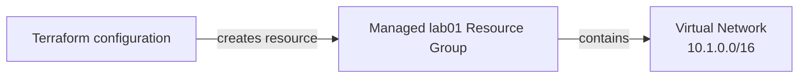

<!--
SPDX-FileCopyrightText: 2026 biro98
SPDX-License-Identifier: MIT
-->

# Lab 01 - First Terraform Deployment

**Estimated difficulty:** Beginner | **Estimated time:** 60-75 minutes

Follow [INSTRUCTIONS.md](INSTRUCTIONS.md) for the step-by-step attendee path through this lab without using the solution.

## Learning objectives

- Recognize Terraform, provider, resource, argument, and reference syntax.
- Execute the `init`, `fmt`, `validate`, `plan`, `apply`, `show`, and `destroy` workflow.
- Explain why Terraform creates local state.

## Scenario

The network team needs a disposable VNet for a design exercise. You will create a dedicated resource group and a VNet inside it, inspect every proposed action, verify Azure, and remove the lab deployment.

## Architecture



Terraform creates `azurerm_resource_group.this`, then uses its name and location for the VNet. This root owns both lifecycles.

## Supplied inputs

Copy `terraform.tfvars.example` to `terraform.tfvars` before running Terraform.

| Input | Purpose |
| --- | --- |
| `resource_group_name` | New group owned by this lab/state, for example `rg-tf-lab01-u01`. |
| `location` | Azure region for the group and VNet, for example `eastus`. |
| `unique_suffix` | Makes resource names unique. Replace `u01` and the group-name suffix consistently. |

The `.example` file documents safe sample values and is committed to Git. Your copied `terraform.tfvars` is local input and must not be committed.

## Key concepts

- A **provider** connects Terraform to an API. The `azurerm` provider translates configuration into Azure operations.
- A **resource block** declares an object Terraform should manage: `azurerm_resource_group.this` or `azurerm_virtual_network.this`. A **data block** reads existing information without managing its lifecycle; Lab 05 demonstrates one.
- A **reference** such as `azurerm_resource_group.this.name` reads an attribute and creates an implicit dependency. Terraform creates the group before creating the VNet.
- **State** is Terraform's local mapping between addresses and Azure resource IDs. Terraform creates `terraform.tfstate` after apply so later plans can compare configuration, prior state, and Azure reality.
- A **plan** is a proposed change, not a deployment. `+` means create, `~` means update, and `-` means destroy.

## Prerequisites

On the workshop VM, bootstrap configures `ARM_USE_MSI=true`, `ARM_SUBSCRIPTION_ID`, and `ARM_TENANT_ID` for Terraform. Open a fresh PowerShell session if needed. Use `az login --identity` for CLI commands; do not sign in with a user, tenant/device flow, or client secret. Provider and backend authentication are separate. To refresh the current shell's ARM variables and CLI identity login, run `& "C:\Program Files\TerraformWorkshop\Connect-WorkshopAzure.ps1"`.

The VM identity has Contributor at subscription scope so Terraform can create lab groups. Your VM setup registers required providers in your subscription; retain `resource_provider_registrations = "none"`. No earlier lab state is required.

Set `resource_group_name` to a new group unique to this lab/state (example `rg-tf-lab01-u01`), `location` to an allowed Azure region (example `eastus`), and `unique_suffix` to your own suffix. Keep the group name and suffix consistent with the example, and update any explicit VNet name too. Terraform creates `azurerm_resource_group.this`; network resources use its name/location and AVM uses its ID.

Each Azure lab owns a different resource group. Never use the VM/platform group, another lab's group, or any pre-existing shared group. Starter and reference roots have separate states: use distinct group names and suffixes (the reference examples do), or destroy the first deployment before reusing names. A different suffix alone does not isolate a shared group or canonical DNS zone.

**Existing-state safety:** These instructions assume a fresh dedicated lab deployment. If an older state used a shared or instructor-created group, stop and back up state securely. Coordinate migration with the instructor before changing group names or running apply/destroy. Do not import the shared group, remove ownership blindly, or reuse an old plan; changing group/location can replace resources.

## Files included

- `terraform.tf`: Terraform and provider constraints
- `providers.tf`: AzureRM provider configuration
- `variables.tf`: resource-group name, location, and unique suffix inputs
- `main.tf`: incomplete resources
- `outputs.tf`: values shown after apply
- `terraform.tfvars.example`: safe example values
- `solution/`: independent completed reference, revealed by the instructor on demand (not included in the starter checkout)

## Tasks

1. Review every block and identify its type and label.
2. Copy `terraform.tfvars.example` to `terraform.tfvars`; choose your own suffix.
3. Complete both TODOs in `main.tf`: explain the managed group and finish the VNet name. Keep the managed resource references for resource-group name and location.
4. Initialize, format, validate, plan, and apply.
5. Verify the VNet, inspect state, then destroy the managed group and network.

## Commands and observations

```powershell
Copy-Item terraform.tfvars.example terraform.tfvars
az login --identity # Terraform uses the ARM_* environment set by VM bootstrap.
terraform init
terraform fmt
terraform validate
terraform plan -out main.tfplan
```

During `init`, identify the constrained AzureRM version selected. Validation should report success. In the completed plan, find two `+` create actions and the VNet's managed resource references. Do not apply until you understand the plan.

Expected checkpoints:

1. `terraform init` creates `.terraform/` and selects a provider version in `.terraform.lock.hcl`.
2. `terraform validate` reports that the configuration is valid.
3. The first completed plan reports `2 to add` and no changes or destroys: one group and one VNet.
4. After apply, `terraform state list` reports `azurerm_resource_group.this` and `azurerm_virtual_network.this`.
5. A second plan reports no changes; this is idempotence.

```powershell
terraform apply main.tfplan
terraform show
terraform state list
terraform state show azurerm_virtual_network.this
az network vnet show --resource-group "rg-tf-lab01-u01" --name "vnet-tf-lab01-<your-suffix>" --output table
```

Observe that `terraform.tfstate` maps Terraform addresses to Azure IDs. Do not edit it and do not commit it; state can contain sensitive data.

## Validation steps

- `terraform validate` succeeds.
- `terraform state list` contains the managed resource group and managed VNet.
- Azure CLI reports address space `10.1.0.0/16` in the managed group's region.
- A second `terraform plan` reports no changes.

## Expected result

Your dedicated managed resource group contains the lab-specific VNet. Outputs display the managed group name and the managed VNet ID.

## Questions for discussion

1. How does the VNet reference create an implicit dependency?
2. Why is a plan reviewed before apply in a bank environment?
3. Why must `terraform.tfstate` stay out of Git?

## Cleanup

Review `terraform plan -destroy` in the state that owns this deployment, then run `terraform destroy`. **This deletes the lab resource group and its contents**, not only the resources listed in this root. AzureRM may refuse deletion when unmanaged contents remain; inspect them rather than disabling that safety check. Never put unrelated resources in this group. Verify `az group exists --name "rg-tf-lab01-u01"` returns `false` (use your actual name). Other labs' distinct groups and the platform VM/backend storage must remain. Keep local inputs, state, plans, and populated backend files out of Git.

## Optional challenge

Add non-sensitive `environment = "training"` and `managed_by = "terraform"` tags to the VNet only. Predict the next plan before running it.

## Common mistakes

| Problem | Fix |
| --- | --- |
| Azure login or subscription error | Use `az login --identity` for CLI, and verify the bootstrap-provided `ARM_*` variables for Terraform. |
| Resource name already exists in this subscription | Change `unique_suffix` in `terraform.tfvars`. |
| Resource-group creation fails | Verify the configured subscription, region, policy, and VM identity's subscription Contributor assignment. |
| Terraform was run from the repository root | Change to the Lab 01 folder; every lab has separate state. |
