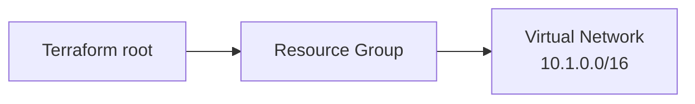

<!--
SPDX-FileCopyrightText: 2026 biro98
SPDX-License-Identifier: MIT
-->

# Lab 01 Reference Solution

This folder is an independent Terraform root implementing the [lab instructions](../INSTRUCTIONS.md).
It creates its own resource group and VNet, not resources in an existing shared group.

## Architecture



## Run the solution

Use Terraform 1.14.5 or newer (below 2.0). Authenticate using the
[VM or laptop instructions](../../common/azure-authentication.md).
Keep `resource_provider_registrations = "none"` for the workshop's preregistered providers.

Run from this `solution` directory. On the first run only, copy
`terraform.tfvars.example` to `terraform.tfvars`. Do not overwrite existing inputs.
Edit the group name and suffix to identify your own dedicated solution resources;
use a different group and suffix from the starter. The sample uses Sweden Central.
Never use the platform VM's group or a shared group.

```powershell
terraform init
terraform fmt -check
terraform validate
terraform plan -out main.tfplan
terraform show main.tfplan
```

With fresh state, expect two creates: one group and one VNet (`10.1.0.0/16`).
Check names and location, then run `terraform apply main.tfplan` and `terraform output`.
The outputs are `resource_group_name` and `virtual_network_id`.

For an existing deployment, set the new `resource_group_name` input to its exact
current group name and retain its current location and suffix. Changing those
values can replace resources; the new sample location is not a migration command.
Review every plan and regenerate it after edits.

Review `terraform plan -destroy` before `terraform destroy`.
**Cleanup deletes this solution's group and everything in it.**
Keep state, plans, credentials, and private input values out of Git.
