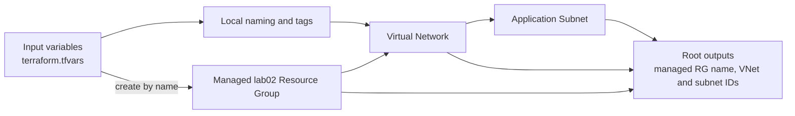

<!--
SPDX-FileCopyrightText: 2026 biro98
SPDX-License-Identifier: MIT
-->

# Lab 02 - Variables, Locals, and Outputs

**Estimated difficulty:** Beginner | **Estimated time:** 75 minutes

Follow [INSTRUCTIONS.md](INSTRUCTIONS.md) for the step-by-step attendee path through this lab without using the solution.

## Learning objectives

Define typed inputs and defaults, use a `.tfvars` file, derive a local name, expose outputs, and identify the implicit dependency graph created by references.

## Scenario

The network pattern must be reusable across training subscriptions without editing resource blocks. Configuration values become the contract between the operator and the Terraform root.

## Architecture



References between resources create the dependency path. Outputs expose selected results without making the caller inspect state directly.

## Supplied inputs

Copy `terraform.tfvars.example` to `terraform.tfvars`. Choose a new `resource_group_name` unique to this lab/state (example `rg-tf-lab02-u01`), set `location` to an approved region such as `eastus`, and personalize `unique_suffix`. Keep the suffix consistent in explicit group/VNet names. The managed group supplies network resource names/locations and AVM parent IDs. Preserve the example's network ranges and policy inputs unless the exercise asks you to change them.

| Input | Purpose |
| --- | --- |
| `unique_suffix` | Value used by the local naming expression. |
| `resource_group_name` | New group owned by this root, never shared across states. |
| `location` | Region for the new group and VNet. |
| `vnet_name`, `subnet_name` | Names of the managed VNet and its child subnet. |
| `vnet_address_space` | Parent network, initially `10.2.0.0/16`. |
| `subnet_prefix` | Child network, initially `10.2.1.0/24`; it must fit inside the VNet range. |

## Key concepts

| Construct | Objective |
| --- | --- |
| `variable` | Define the root module's input contract and expected value type. Access an input with `var.name`. |
| `locals` | Name internal calculated values so expressions are not repeated. Access one with `local.name`. |
| String template | Insert a value into text with `${...}`, as in `"tf-lab02-${var.unique_suffix}"`. |
| `output` | Expose a result after apply, such as a generated Azure ID. Outputs are results, not inputs. |
| Resource reference | Pass one resource's result to another and create a dependency edge. |

Terraform evaluates variables and locals while building the plan. Azure assigns resource IDs during apply, so those values appear as `(known after apply)` in the plan.

## Prerequisites

On the workshop VM, bootstrap configures `ARM_USE_MSI=true`, `ARM_SUBSCRIPTION_ID`, and `ARM_TENANT_ID` for Terraform. Open a fresh PowerShell session if needed. Use `az login --identity` for CLI commands; do not sign in with a user, tenant/device flow, or client secret. Provider and backend authentication are separate. To refresh the current shell's ARM variables and CLI identity login, run `& "C:\Program Files\TerraformWorkshop\Connect-WorkshopAzure.ps1"`.

The VM identity has Contributor at subscription scope so Terraform can create lab groups. Your VM setup registers required providers in your subscription; retain `resource_provider_registrations = "none"`. No earlier lab state is required.

Set `resource_group_name` to a new group unique to this lab/state (example `rg-tf-lab02-u01`), `location` to an allowed Azure region (example `eastus`), and `unique_suffix` to your own suffix. Keep the group name and suffix consistent with the example, and update any explicit VNet name too. Terraform creates `azurerm_resource_group.this`; network resources use its name/location and AVM uses its ID.

Each Azure lab owns a different resource group. Never use the VM/platform group, another lab's group, or any pre-existing shared group. Starter and reference roots have separate states: use distinct group names and suffixes (the reference examples do), or destroy the first deployment before reusing names. A different suffix alone does not isolate a shared group or canonical DNS zone.

**Existing-state safety:** These instructions assume a fresh dedicated lab deployment. If an older state used a shared or instructor-created group, stop and back up state securely. Coordinate migration with the instructor before changing group names or running apply/destroy. Do not import the shared group, remove ownership blindly, or reuse an old plan; changing group/location can replace resources.

## Files included

The standard Terraform files contain explicit TODOs; `terraform.tfvars.example` supplies non-secret examples. The instructor reveals the separate completed `solution/` root on demand; it is not included in the starter checkout.

## Tasks

1. Define the four missing network variables (`vnet_name`, `vnet_address_space`, `subnet_name`, and `subnet_prefix`) as strings. Required inputs `resource_group_name`, `location`, and `unique_suffix` are already declared.
2. Build `local.name_prefix` and decide where it adds value without duplicating explicit input names.
3. Inspect the managed resource group and create the VNet and subnet with managed resource references for the group name and location.
4. Output the resource group name, VNet ID, and subnet ID.
5. Deploy, then change the VNet CIDR and subnet prefix to `10.22.0.0/16` and `10.22.1.0/24`.

## Commands and observations

```powershell
Copy-Item terraform.tfvars.example terraform.tfvars
az login --identity # Terraform uses the ARM_* environment set by VM bootstrap.
terraform init
terraform fmt
terraform validate
terraform graph
terraform plan -out main.tfplan
terraform apply main.tfplan
terraform output
```

Inspect the completed first plan for three creates: group, VNet, and subnet. Optionally render `terraform graph` with Graphviz and trace the subnet-to-VNet dependency. After changing both CIDRs, run `terraform plan` but do not apply immediately: identify whether AzureRM proposes an in-place update or replacement and explain why the subnet must remain inside the VNet address space.

Expected checkpoints:

1. The first completed plan creates one resource group, one VNet, and one subnet.
2. The subnet reference orders it after the VNet even though files have no execution order.
3. `terraform output` displays values selected by the output blocks.
4. A no-change plan after apply proves that the same inputs produce the same desired state.

## Validation steps

Run `terraform validate`, confirm three managed-resource state addresses including `azurerm_resource_group.this`, inspect all three outputs, and run `az network vnet subnet show` for the deployed subnet. A final plan should show no changes.

## Expected result

The managed lab group contains the lab-specific VNet and one subnet. Outputs expose the managed group name and the managed VNet and subnet IDs.

## Questions for discussion

1. Which values belong in variables and which are better derived as locals?
2. How do references turn into dependency graph edges?
3. How do desired configuration, Terraform state, and current Azure state differ?

## Cleanup

Review `terraform plan -destroy` in the state that owns this deployment, then run `terraform destroy`. **This deletes the lab resource group and its contents**, not only the resources listed in this root. AzureRM may refuse deletion when unmanaged contents remain; inspect them rather than disabling that safety check. Never put unrelated resources in this group. Verify `az group exists --name "rg-tf-lab02-u01"` returns `false` (use your actual name). Other labs' distinct groups and the platform VM/backend storage must remain. Keep local inputs, state, plans, and populated backend files out of Git.

## Optional challenge

Add validation rules that require the suffix to be lowercase alphanumeric and each CIDR string to pass `can(cidrnetmask(...))`.

## Next lab

Continue with `lab02a-expressions-functions` to practice conditionals, `for` expressions, collection filtering, function composition, CIDR calculation, and `terraform console` before creating the larger Azure network in Lab 03.

## Common mistakes

| Problem | Fix |
| --- | --- |
| Terraform requests a missing value | Define the variable and confirm the copied `terraform.tfvars` contains it. |
| Azure rejects the subnet | Confirm the `/24` subnet is entirely inside the `/16` VNet. |
| A local value is not found | Use `local.name_prefix`, not `var.name_prefix`. |
| An output is blank before apply | Some provider values, including IDs, are unknown until Azure creates the resource. |
