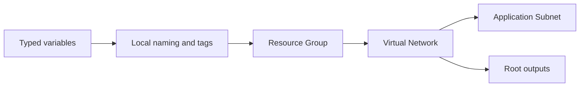

<!--
SPDX-FileCopyrightText: 2026 biro98
SPDX-License-Identifier: MIT
-->

# Lab 02 Reference Solution

This independent root implements the [lab instructions](../INSTRUCTIONS.md):
typed variables, locals, references, and outputs.

## Architecture



## Run the solution

Use Terraform 1.14.5 or newer (below 2.0) and the
[VM or laptop authentication instructions](../../common/azure-authentication.md).
The workshop preregisters providers, so keep `resource_provider_registrations = "none"`.

Work in this `solution` directory. On the first run only, copy
`terraform.tfvars.example` to `terraform.tfvars`; never overwrite existing inputs.
Choose your own dedicated group, suffix, and VNet name. Do not share the starter's
group or a platform/shared group. The sample region is Sweden Central.

```powershell
terraform init
terraform fmt -check
terraform validate
terraform plan -out main.tfplan
terraform show main.tfplan
```

With fresh state, expect three creates: group, VNet (`10.2.0.0/16`), and subnet
(`10.2.1.0/24`). Review the plan before `terraform apply main.tfplan`.
Run `terraform output` to see `resource_group_name`, `vnet_id`, and `subnet_id`.
The subnet's state address is `azurerm_subnet.this`.

A `moved` block preserves the previous solution's `azurerm_subnet.application`
state address without recreating the subnet. Existing users must retain their
current input values, especially location and resource names; input changes can
still cause replacements. Always generate a fresh plan after edits.

Review `terraform plan -destroy` before `terraform destroy`.
**Cleanup deletes this solution's group and everything in it.**
Keep state, plans, credentials, and private input values out of Git.
