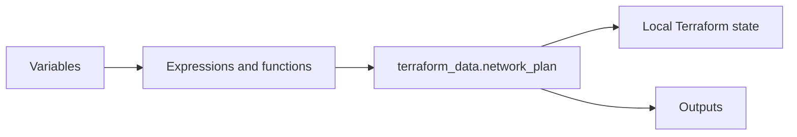

<!--
SPDX-FileCopyrightText: 2026 biro98
SPDX-License-Identifier: MIT
-->

# Lab 02A - Terraform Expressions and Functions

**Difficulty:** Beginner | **Time:** 45 minutes | **Azure resources:** None

Follow [INSTRUCTIONS.md](INSTRUCTIONS.md) for the step-by-step attendee path through this lab without using the solution.

## Learning objectives

- Test Terraform expressions with `terraform console`.
- Use string, collection, and network functions.
- Create values with conditionals and `for` expressions.
- Store and inspect calculated data with `terraform_data`.

## Scenario

The network team has a project name, a base CIDR, and several subnet names. You will transform those inputs into consistent names, subnet CIDRs, tags, and a readable summary before creating real Azure resources.

## Architecture



## Supplied inputs

  The lab provides `terraform.tfvars.example`. Copy it to `terraform.tfvars`; do not invent the data structure.

  | Input | Supplied value | Why the lab uses it |
  | --- | --- | --- |
  | `project_name` | `"Payments Platform"` | Demonstrates cleaning and normalizing a human-friendly name. |
  | `environment` | `"dev"` | Drives validation, lowercase conversion, naming, and tags. |
  | `unique_suffix` | `"rv02a"` | Makes the calculated prefix unique; replace it with your own short suffix. |
  | `base_cidr` | `"10.20.0.0/16"` | Parent network from which subnet CIDRs are calculated. |
  | `subnet_newbits` | `8` | Changes the `/16` into `/24` subnets because $16 + 8 = 24$. |
  | `subnet_names` | Application, Data, Private Endpoints | Supplies the names and order for the subnet `for` expression. |
  | `extra_tags` | Cost center and owner | Demonstrates merging optional tags with required tags. |

## Function objectives

  An **expression** is any Terraform language statement that produces a value. A **function** is a named operation used inside an expression, such as `lower(...)`. A conditional (`condition ? true_value : false_value`) and a `for` expression are language constructs, not functions.

  | Function | Objective in this lab |
  | --- | --- |
  | `trimspace(string)` | Remove accidental spaces at the beginning or end of `project_name`. |
  | `lower(string)` | Produce predictable lowercase names, comparisons, and tags. |
  | `replace(string, old, new)` | Replace spaces with `-` for names or `_` for stable map keys. |
  | `join(separator, list)` | Combine naming parts into one consistent prefix. |
  | `contains(list, value)` | Validate that `environment` is one of `dev`, `test`, or `prod`. |
  | `can(expression)` | Test whether CIDR parsing succeeds without stopping evaluation with an error. |
  | `cidrnetmask(cidr)` | Parse `base_cidr` during validation; inside `can`, it rejects invalid CIDR text. |
  | `length(collection)` | Count subnets, check that the input list is not empty, and build the summary. |
  | `distinct(list)` | Remove duplicate names temporarily so validation can compare counts and detect duplicates. |
  | `cidrsubnet(prefix, newbits, number)` | Calculate each `/24` subnet from the supplied `/16` and loop index. |
  | `cidrhost(prefix, host)` | Calculate a representative host address, using host number `4` in each subnet. |
  | `strcontains(string, substring)` | Mark a subnet as a private endpoint subnet when its name contains `private`. |
  | `merge(map1, map2)` | Combine optional and required tags; later maps win when keys conflict. |
  | `format(template, values...)` | Produce one readable summary from strings and subnet counts. |

  The solution nests functions where one result becomes another function's input. Read nested calls from the inside out: `replace(lower(trimspace(var.project_name)), " ", "-")` trims first, then lowercases, then replaces spaces.

## Key concepts

### `terraform console`

  `terraform console` is an interactive calculator for the Terraform language. Use it to test an expression and see the result immediately.

  ```text
  > upper("network team")
  "NETWORK TEAM"
  ```

  The `>` is the console prompt; do not type it. Console experiments are temporary: they do not change files, state, or Azure. Type `exit` to return to PowerShell.

### `terraform_data`

  `terraform_data` is a resource built into Terraform. It stores an input value in Terraform state but creates nothing in Azure. In this lab it lets you practice `plan`, `apply`, outputs, state inspection, and `destroy` safely and without cost.

  ```hcl
  resource "terraform_data" "network_plan" {
    input = local.subnets
  }
  ```

  The resource address is `terraform_data.network_plan`. After apply, its `input` is visible in state.

## Prerequisites

Terraform CLI 1.14.5 or newer 1.x and PowerShell. No Azure login or cloud permissions are required.

## 1. Prepare the lab

From the repository root, open PowerShell and run:

```powershell
Set-Location .\lab02a-expressions-functions
Copy-Item terraform.tfvars.example terraform.tfvars
terraform init
```

Confirm that the current folder ends with `lab02a-expressions-functions`. This lab does not require `az login` because it creates no Azure resources.

## 2. Try expressions in the console

Start the console with the lab inputs:

```powershell
terraform console -var-file="terraform.tfvars"
```

Enter each expression separately:

| Expression | What it teaches | Expected result |
| --- | --- | --- |
| `replace(lower(trimspace(var.project_name)), " ", "-")` | Nested string functions | `"payments-platform"` |
| `var.environment == "prod" ? "prod" : "nonprod"` | Conditional expression | `"nonprod"` |
| `merge(var.extra_tags, { environment = lower(var.environment) })` | Combining maps | A map containing `environment = "dev"` |
| `cidrsubnet(var.base_cidr, var.subnet_newbits, 0)` | Calculating a subnet | `"10.20.0.0/24"` |
| `[for name in var.subnet_names : lower(replace(name, " ", "_"))]` | Transforming a list | `application`, `data`, `private_endpoints` |

Type `exit` when finished. The next commands must run in PowerShell, not at the `>` prompt.

## 3. Build the calculated values

Open `main.tf` and follow its first TODO. Create one `locals` block containing:

1. A normalized project name using `trimspace`, `lower`, and `replace`.
2. A `prod` or `nonprod` value using a conditional expression.
3. A name prefix using `join("-", [local.normalized_project_name, local.environment_tier, var.unique_suffix])`.
4. A subnet map using a `for` expression, `cidrsubnet`, and `cidrhost`.
5. A filtered `routed_subnets` map that excludes private endpoint subnets.
6. Required `environment = lower(var.environment)` and `managed_by = "terraform"` tags merged after `var.extra_tags`, so required values win.
7. A summary created with `format` and `length`.

Use these reference patterns:

```hcl
normalized_project_name = replace(lower(trimspace(var.project_name)), " ", "-")
environment_tier        = lower(var.environment) == "prod" ? "prod" : "nonprod"

subnets = {
  for index, name in var.subnet_names : lower(replace(name, " ", "_")) => {
    address_prefix = cidrsubnet(var.base_cidr, var.subnet_newbits, index)
  }
}
```

Use `var.name` to read an input variable and `local.name` to read another local value. If you need the complete implementation after attempting the task, ask the instructor to reveal `solution/main.tf` on demand; it is not included in the starter checkout.

The starter comments refer to older README step numbers. Follow this section for locals, section 4 for the resource and outputs, and [INSTRUCTIONS.md](INSTRUCTIONS.md) for the full sequence. A valid configuration containing only those comments is not a completed exercise.

## 4. Use `terraform_data`

Follow the second TODO in `main.tf`. Add a resource whose `input` contains the calculated prefix, subnets, routed subnets, tags, and summary:

```hcl
resource "terraform_data" "network_plan" {
  input = {
    name_prefix    = local.name_prefix
    subnets        = local.subnets
    routed_subnets = local.routed_subnets
    tags           = local.common_tags
    summary        = local.summary
  }
}
```

This is how the lab uses `terraform_data`: Terraform will track the calculated object in local state, but no API call is made to Azure.

Open `outputs.tf` and complete its TODO. Add outputs for `local.name_prefix`, `local.subnets`, `local.routed_subnets`, `local.common_tags`, and `local.summary`. Use this pattern for each output:

```hcl
output "name_prefix" {
  value = local.name_prefix
}
```

## 5. Validate, apply, and inspect

```powershell
terraform fmt
terraform validate
terraform plan -out main.tfplan
terraform apply main.tfplan
terraform output
terraform state list
terraform state show terraform_data.network_plan
```

Check that:

- The plan contains only `terraform_data.network_plan`.
- The subnet CIDRs are `10.20.0.0/24`, `10.20.1.0/24`, and `10.20.2.0/24`.
- `routed_subnets` excludes `private_endpoints`.
- `terraform state list` contains exactly `terraform_data.network_plan`.

## 6. Clean up

```powershell
terraform destroy
```

Review the plan and type `yes`. Terraform removes the stored object from local state; there is no Azure resource to delete.

## Troubleshooting

| Problem | Fix |
| --- | --- |
| `terraform` is not recognized | Install Terraform, reopen PowerShell, and run `terraform version`. |
| A required variable has no value | Confirm `terraform.tfvars` exists in this lab folder. |
| The terminal shows `>` | You are in the console. Type `exit`. |
| A local value is undeclared | Check the spelling of the name after `local.`. |
| The plan contains Azure resources | Stop and verify that you are in the Lab 02A folder. |

## Discussion

1. What is the difference between an expression and a function call?
2. Why is the console useful before adding an expression to configuration?
3. Why does argument order matter with `merge`?
4. What does `terraform_data` add to state, and what does it create in Azure?