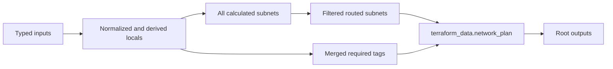

<!--
SPDX-FileCopyrightText: 2026 biro98
SPDX-License-Identifier: MIT
-->

# Lab 02A Reference Solution

This independent root demonstrates one implementation of the expression requirements. It uses no Azure provider and creates only `terraform_data.network_plan`.

## Expression coverage

| Category | Examples |
| --- | --- |
| References and operators | `var.environment`, `==`, `!` |
| Conditional expression | production versus nonproduction naming |
| String functions | `trimspace`, `lower`, `replace`, `join`, `format`, `strcontains` |
| Collection functions | `merge`, `length` |
| Network functions | `cidrsubnet`, `cidrhost`, `cidrnetmask` |
| Defensive evaluation | `can` |
| Collection expressions | map transformation and filtering with `for` |

## Data flow



## Run the solution

Use Terraform 1.14.5 or newer (below 2.0) from this directory. The committed `terraform.tfvars` contains
non-secret sample inputs and is loaded automatically; there is no example to copy.
This lab has no Azure region because it creates no Azure resources.

```powershell
terraform init
terraform fmt -check
terraform validate
terraform plan -out main.tfplan
terraform apply main.tfplan
terraform output
terraform state list
```

Expect only `terraform_data.network_plan`, the prefix
`payments-platform-nonprod-rv02a`, three `/24` subnet ranges
(`10.20.0.0/24`, `10.20.1.0/24`, `10.20.2.0/24`), representative IPs ending in `.4`,
and two routed entries (`application`, `data`). The summary ends with
`3 subnets (2 routed)`. The comments in `main.tf` explain each calculation.
The five outputs are `name_prefix`, `subnets`, `routed_subnets`, `common_tags`,
and `summary`, matching the [lab instructions](../INSTRUCTIONS.md).
Required tags override conflicting `environment` and `managed_by` extra tags.
An earlier solution added `tf-` to the prefix and extra subnet-name/workload fields;
updating that existing local data resource changes its recorded input, not Azure resources.

Run `terraform destroy` to remove the local data resource. Never commit state,
plans, credentials, or private values. Use an ignored `personal.auto.tfvars` for
local input overrides instead of editing the published sample.