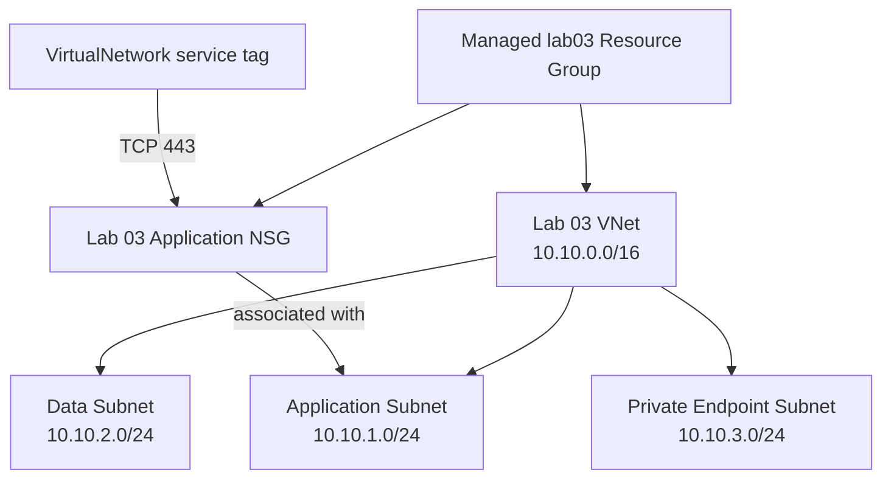

<!--
SPDX-FileCopyrightText: 2026 biro98
SPDX-License-Identifier: MIT
-->

# Lab 03 - Azure Networking Basics

**Estimated difficulty:** Beginner-intermediate | **Estimated time:** 90 minutes

Follow [INSTRUCTIONS.md](INSTRUCTIONS.md) for the step-by-step attendee path through this lab without using the solution.

## Learning objectives

Model Azure resource relationships, create subnets explicitly, configure an NSG rule, associate an NSG, and follow resource IDs through a plan.

## Scenario

A bank application needs separate application, data, and private endpoint network zones. Repetition is intentional here so the underlying Azure resources remain visible.

## Architecture



The NSG is a separate Azure resource. Terraform also creates an explicit association resource that attaches it to the application subnet.

## Supplied inputs

Copy `terraform.tfvars.example` to `terraform.tfvars`. Choose a new `resource_group_name` unique to this lab/state (example `rg-tf-lab03-u01`), set `location` to an approved region such as `eastus`, and personalize `unique_suffix`. Keep the suffix consistent in explicit group/VNet names. The managed group supplies network resource names/locations and AVM parent IDs. Preserve the example's network ranges and policy inputs unless the exercise asks you to change them.

## Key concepts

- An **NSG** contains network filtering rules; it does not protect a subnet until an association attaches it.
- `azurerm_subnet_network_security_group_association` models that attachment as a separate relationship.
- The `VirtualNetwork` **service tag** represents Azure's current virtual-network address space. It is safer and easier to maintain than repeating CIDRs, but it is still broader than one named subnet.
- Rule **priority** is evaluated from lower numbers to higher numbers. A matching rule stops further evaluation.
- `(known after apply)` means Azure must create an object before its ID is available; it is not an error.
- Private endpoint network-policy settings are subnet-specific. Do not disable them on ordinary workload subnets without a design reason.

## Prerequisites

On the workshop VM, bootstrap configures `ARM_USE_MSI=true`, `ARM_SUBSCRIPTION_ID`, and `ARM_TENANT_ID` for Terraform. Open a fresh PowerShell session if needed. Use `az login --identity` for CLI commands; do not sign in with a user, tenant/device flow, or client secret. Provider and backend authentication are separate. To refresh the current shell's ARM variables and CLI identity login, run `& "C:\Program Files\TerraformWorkshop\Connect-WorkshopAzure.ps1"`.

The VM identity has Contributor at subscription scope so Terraform can create lab groups. Your VM setup registers required providers in your subscription; retain `resource_provider_registrations = "none"`. No earlier lab state is required.

Set `resource_group_name` to a new group unique to this lab/state (example `rg-tf-lab03-u01`), `location` to an allowed Azure region (example `eastus`), and `unique_suffix` to your own suffix. Keep the group name and suffix consistent with the example, and update any explicit VNet name too. Terraform creates `azurerm_resource_group.this`; network resources use its name/location and AVM uses its ID.

Each Azure lab owns a different resource group. Never use the VM/platform group, another lab's group, or any pre-existing shared group. Starter and reference roots have separate states: use distinct group names and suffixes (the reference examples do), or destroy the first deployment before reusing names. A different suffix alone does not isolate a shared group or canonical DNS zone.

**Existing-state safety:** These instructions assume a fresh dedicated lab deployment. If an older state used a shared or instructor-created group, stop and back up state securely. Coordinate migration with the instructor before changing group names or running apply/destroy. Do not import the shared group, remove ownership blindly, or reuse an old plan; changing group/location can replace resources.

## Files included

Standard root files, a TODO-based `main.tf`, and example values. The instructor reveals the independent complete `solution/` on demand; it is not included in the starter checkout.

## Tasks

1. Create the VNet and three individually declared subnets.
2. Create `nsg-tf-lab03-application-<suffix>` and an inbound rule allowing TCP 443 from the `VirtualNetwork` service tag, not the internet.
3. Associate it with the application subnet.
4. Output three subnet IDs and inspect the plan dependencies.

## Commands to execute

```powershell
Copy-Item terraform.tfvars.example terraform.tfvars
az login --identity # Terraform uses the ARM_* environment set by VM bootstrap.
terraform init
terraform fmt
terraform validate
terraform plan -out main.tfplan
terraform show main.tfplan
terraform apply main.tfplan
```

In the plan, locate values marked known after apply and identify references that order the managed group, VNet, subnets, NSG, rule, and association. Expect eight managed creates including the group. Confirm the rule is not an unrestricted inbound rule.

Build and review in this order:

1. VNet and three non-overlapping subnet resources.
2. Application NSG and its TCP 443 rule.
3. Subnet-to-NSG association.
4. Outputs and plan review.

The file order does not control deployment order; references build the dependency graph.

## Validation steps

Use `terraform state list`, `terraform output`, and `az network vnet subnet list --resource-group <rg> --vnet-name <vnet> --output table`. Check the NSG association on application and the private endpoint policy setting.

## Expected result

The managed lab group contains the Lab 03 VNet, three subnets, one NSG, one rule, and one association, isolated from all other labs. Outputs expose the three subnet IDs.

## Questions for discussion

1. Which references create implicit dependencies here?
2. Why is an NSG association a separate Terraform resource?
3. What problems appear if this design needs 30 subnets?

## Cleanup

Review `terraform plan -destroy` in the state that owns this deployment, then run `terraform destroy`. **This deletes the lab resource group and its contents**, not only the resources listed in this root. AzureRM may refuse deletion when unmanaged contents remain; inspect them rather than disabling that safety check. Never put unrelated resources in this group. Verify `az group exists --name "rg-tf-lab03-u01"` returns `false` (use your actual name). Other labs' distinct groups and the platform VM/backend storage must remain. Keep local inputs, state, plans, and populated backend files out of Git.

## Optional challenge

Create a second NSG named `nsg-tf-lab03-data-<suffix>` in the managed group's name and location for the data subnet, allowing SQL port 1433 only from `10.10.1.0/24`. Explain why this is still only one layer of security.

## Common mistakes

| Problem | Fix |
| --- | --- |
| Two subnet CIDRs overlap | Give each subnet a unique `/24` inside `10.10.0.0/16`. |
| The NSG exists but protects nothing | Add the subnet NSG association resource. |
| Inbound source is `*` or `Internet` | Use the required scoped service tag or approved management CIDR. |
| Thirty subnets would require thirty copied blocks | That scaling problem is intentional; Lab 04 replaces duplication with `for_each`. |
