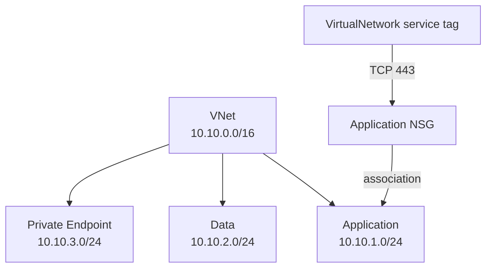

<!--
SPDX-FileCopyrightText: 2026 biro98
SPDX-License-Identifier: MIT
-->

# Lab 03 Reference Solution

This independent root uses explicit resources so every relationship is visible.
It includes three non-overlapping subnets, an application NSG, an inbound TCP 443
rule from the `VirtualNetwork` service tag, and an NSG association.

## Architecture



## Run the solution

Use Terraform 1.14.5 or newer (below 2.0) and the workshop VM's managed-identity authentication described
in the [lab README](../README.md). Keep `resource_provider_registrations = "none"`;
VM bootstrap registers the required providers.

The committed `terraform.tfvars` contains only non-secret sample values and loads
automatically: Sweden Central (`swedencentral`), suffix `ref03`, and the dedicated
group `rg-tf-lab03-ref03`. No example file needs copying. For a shared subscription,
choose your own suffix and matching group name in an ignored `personal.auto.tfvars`.
Never reuse the starter's group, a shared group, or the platform VM group.

```powershell
terraform init
terraform fmt -check
terraform validate
terraform plan -out main.tfplan
terraform show main.tfplan
```

For a fresh state, expect eight creates: one group, one VNet, three subnets, one
NSG, one security rule, and one association. Confirm the region, group name, and
private endpoint subnet's disabled network policies before applying.
The application and data subnets explicitly keep those policies enabled.
Outputs are `application_subnet_id`, `data_subnet_id`, and
`private_endpoints_subnet_id`, as in the [lab instructions](../INSTRUCTIONS.md).
The HTTPS rule includes the description used for the guide's in-place edit exercise.
The explicit HTTPS rule does not remove Azure's default NSG rules; it is not an
HTTPS-only isolation policy.

After reviewing the plan, run `terraform apply main.tfplan` and `terraform output`.
Review `terraform plan -destroy` before cleanup with `terraform destroy`.
**Destroy deletes this solution's resource group and its contents.** Do not place
unrelated resources in it. For existing state, review replacements caused by
changing the group, suffix, or region; never reuse a saved plan from before those changes.
Keep private overrides, credentials, state, and plans out of Git.

## Updating an earlier solution deployment

The private endpoint subnet now uses the guide's plural name
`snet-private-endpoints` and state address `azurerm_subnet.private_endpoints`.
A `moved` block handles the previous singular Terraform address. **Changing the
Azure subnet name still requires replacement**; do not apply that change against a
populated subnet. Use a fresh solution deployment or retain the old Azure subnet
name locally until an instructor has reviewed dependencies and a migration plan.
Consumers of the old singular output must switch to `private_endpoints_subnet_id`.
On a laptop, follow the [non-VM authentication setup](../../common/azure-authentication.md#running-without-the-workshop-vm).
