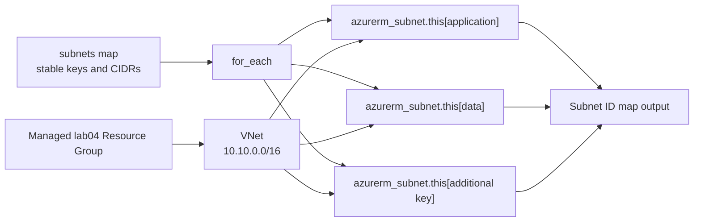

<!--
SPDX-FileCopyrightText: 2026 biro98
SPDX-License-Identifier: MIT
-->

# Lab 04 - for_each and Data Structures

**Estimated difficulty:** Intermediate | **Estimated time:** 90 minutes

Follow [INSTRUCTIONS.md](INSTRUCTIONS.md) for the step-by-step attendee path through this lab without using the solution.

## Learning objectives

Use list, set, map, object, `for_each`, `count`, conditional expressions, and keyed outputs; explain why stable names matter in state.

## Scenario

The network team wants configuration-driven subnet creation. Adding a subnet should modify input data rather than module logic or duplicated resource blocks.

## Architecture



Your dedicated Terraform-managed resource group contains the Lab 04 VNet. Each map key becomes a stable Terraform instance address, allowing the subnet collection to grow without duplicating resource blocks.

## Supplied inputs

Copy `terraform.tfvars.example` to `terraform.tfvars`. Choose a new `resource_group_name` unique to this lab/state (example `rg-tf-lab04-u01`), set `location` to an approved region such as `eastus`, and personalize `unique_suffix`. Keep the suffix consistent in explicit group/VNet names. The managed group supplies network resource names/locations and AVM parent IDs. Preserve the example's network ranges and policy inputs unless the exercise asks you to change them.

## Key concepts

| Construct | Objective |
| --- | --- |
| `map(object(...))` | Require named entries with a predictable object shape. Terraform rejects missing or incorrectly typed fields before Azure is called. |
| `for_each = var.subnets` | Create one resource instance for every map entry. |
| `each.key` | Read the stable map key, such as `application`; it becomes part of the state address. |
| `each.value` | Read the matching object, such as its `address_prefix`. |
| `for` expression | Transform a collection into another list or map, including the keyed output map. |
| `keys(map)` | Return the map's keys for inspection. |
| `toset(list)` | Convert a list to a set, removing ordering and duplicates. |

`for_each` is usually safer than `count` for named infrastructure. Reordering a list can change count indexes, while map keys keep addresses such as `azurerm_subnet.this["application"]` stable. Renaming a key changes the Terraform address and can cause a destroy/create plan even when the CIDR is unchanged.

## Prerequisites

On the workshop VM, bootstrap configures `ARM_USE_MSI=true`, `ARM_SUBSCRIPTION_ID`, and `ARM_TENANT_ID` for Terraform. Open a fresh PowerShell session if needed. Use `az login --identity` for CLI commands; do not sign in with a user, tenant/device flow, or client secret. Provider and backend authentication are separate. To refresh the current shell's ARM variables and CLI identity login, run `& "C:\Program Files\TerraformWorkshop\Connect-WorkshopAzure.ps1"`.

The VM identity has Contributor at subscription scope so Terraform can create lab groups. Your VM setup registers required providers in your subscription; retain `resource_provider_registrations = "none"`. No earlier lab state is required.

Set `resource_group_name` to a new group unique to this lab/state (example `rg-tf-lab04-u01`), `location` to an allowed Azure region (example `eastus`), and `unique_suffix` to your own suffix. Keep the group name and suffix consistent with the example, and update any explicit VNet name too. Terraform creates `azurerm_resource_group.this`; network resources use its name/location and AVM uses its ID.

Each Azure lab owns a different resource group. Never use the VM/platform group, another lab's group, or any pre-existing shared group. Starter and reference roots have separate states: use distinct group names and suffixes (the reference examples do), or destroy the first deployment before reusing names. A different suffix alone does not isolate a shared group or canonical DNS zone.

**Existing-state safety:** These instructions assume a fresh dedicated lab deployment. If an older state used a shared or instructor-created group, stop and back up state securely. Coordinate migration with the instructor before changing group names or running apply/destroy. Do not import the shared group, remove ownership blindly, or reuse an old plan; changing group/location can replace resources.

## Files included

Standard root files with a structured variable and TODOs. The instructor reveals the complete independent `solution/` on demand; it is not included in the starter checkout.

## Tasks

1. Implement one subnet resource with `for_each`.
2. Keep the initial three subnet entries for the first deployment; after applying, test adding `management = { address_prefix = "10.10.4.0/24" }` only in `terraform.tfvars`.
3. Output a map of all subnet IDs.
4. Compare keyed addresses in `terraform state list`.
5. In `terraform console`, evaluate `keys(var.subnets)`, `toset(keys(var.subnets))`, and `[for subnet in var.subnets : subnet.address_prefix]`.

## Commands to execute

```powershell
Copy-Item terraform.tfvars.example terraform.tfvars
az login --identity # Terraform uses the ARM_* environment set by VM bootstrap.
terraform init
terraform fmt
terraform validate
terraform console # Evaluate the expressions above, then type exit before continuing.
terraform plan -out main.tfplan
terraform apply main.tfplan
terraform state list
```

Before apply, verify one subnet resource block expands into three keyed instances: five managed creates total with the group and VNet. After adding management, confirm the plan adds only one subnet and does not renumber existing instances.

Guided checkpoints:

1. In `terraform console`, run `keys(var.subnets)` and confirm the three supplied keys.
2. In the plan, find three instances generated from one subnet resource block.
3. After apply, add `management = { address_prefix = "10.10.4.0/24" }` to your copied `terraform.tfvars`, not the committed example.
4. The next plan must add only `azurerm_subnet.this["management"]`.

## Validation steps

Check that output keys match input keys, state addresses contain `azurerm_subnet.this["application"]`, and a no-change plan follows apply.

## Expected result

Subnet inventory in the Lab 04 VNet is controlled by a typed map, and each subnet has a stable state address tied to its key. The `subnet_ids` output maps those keys to IDs in the managed lab group.

## Questions for discussion

1. Why is `for_each` usually safer than `count` for named infrastructure?
2. What happens if a map key is renamed while the Azure `name` also changes?
3. How do type constraints prevent bad configuration before Azure is called?

## Cleanup

Review `terraform plan -destroy` in the state that owns this deployment, then run `terraform destroy`. **This deletes the lab resource group and its contents**, not only the resources listed in this root. AzureRM may refuse deletion when unmanaged contents remain; inspect them rather than disabling that safety check. Never put unrelated resources in this group. Verify `az group exists --name "rg-tf-lab04-u01"` returns `false` (use your actual name). Other labs' distinct groups and the platform VM/backend storage must remain. Keep local inputs, state, plans, and populated backend files out of Git.

## Optional challenge

Extend each object with `associate_nsg = optional(bool, false)`. Create `nsg-tf-lab04-<suffix>` using the managed group's name and location and conditionally associate it using a filtered `for_each` map.

## Common mistakes

| Problem | Fix |
| --- | --- |
| `each.key` is unavailable | Use it only inside a block that declares `for_each`. |
| Object attribute is missing | Match the `map(object(...))` structure exactly in `terraform.tfvars`. |
| Existing subnets are replaced after an edit | Check whether you renamed map keys; keys are state identity. |
| Console cannot find variables | Start it with `terraform console -var-file="terraform.tfvars"`. |
