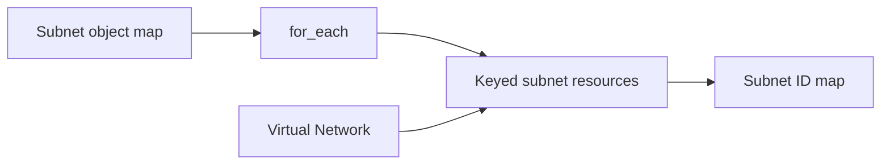

<!--
SPDX-FileCopyrightText: 2026 biro98
SPDX-License-Identifier: MIT
-->

# Lab 04 Reference Solution

This independent root demonstrates stable keyed subnet instances and a map output.
One subnet resource block expands the supplied map with `for_each`.

## Architecture



## Run the solution

Use Terraform 1.14.5 or newer (below 2.0) and the workshop VM's managed-identity authentication described
in the [lab README](../README.md). Keep `resource_provider_registrations = "none"`;
VM bootstrap registers the required providers.

The committed `terraform.tfvars` contains non-secret sample inputs and loads
automatically: Sweden Central (`swedencentral`), suffix `ref04`, the dedicated group
`rg-tf-lab04-ref04`, and three subnet entries. No example file needs copying.
For a shared subscription, choose a unique suffix and matching group name in an
ignored `personal.auto.tfvars`. Never reuse the starter's group or a shared/platform group.

```powershell
terraform init
terraform fmt -check
terraform validate
terraform plan -out main.tfplan
terraform show main.tfplan
```

For a fresh state, expect five creates: one group, one VNet, and three keyed subnets.
After reviewing the plan, run `terraform apply main.tfplan`, `terraform state list`,
and `terraform output subnet_ids`. The output keys must match the input map keys.

To demonstrate adding a subnet without duplicating resources, put the complete
`subnets` map in `personal.auto.tfvars`, retaining the three sample entries and adding
`management = { address_prefix = "10.10.4.0/24" }`. A variable override replaces the
whole map, not just one entry. The next plan should add only
`azurerm_subnet.this["management"]`. Reordering keys does not renumber instances;
renaming a key can cause a destroy/create operation.

Review `terraform plan -destroy` before cleanup with `terraform destroy`.
**Destroy deletes this solution's resource group and its contents.** Do not place
unrelated resources in it. If using existing state, review any replacements caused
by changed group, suffix, or region before applying.
Keep private overrides, credentials, state, and plans out of Git.
