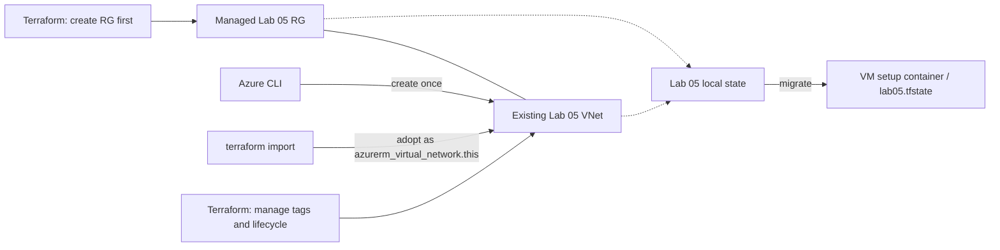

<!--
SPDX-FileCopyrightText: 2026 biro98
SPDX-License-Identifier: MIT
-->

# Lab 05 - Terraform State, VNet Import, and Drift

**Estimated difficulty:** Intermediate | **Estimated time:** 90-120 minutes

Start with [INSTRUCTIONS.md](INSTRUCTIONS.md) for the complete beginner walkthrough, code edits, commands and stop/check points. This README is the conceptual reference; do not run both guides as two separate deployments.

## Learning objectives

Read existing Azure information with data sources, create a VNet outside Terraform, import it into state, reconcile tag drift, and migrate that same state to the Azure Blob backend created by your own VM setup.

## Scenario and architecture

Terraform creates a dedicated Lab 05 resource group first. Create **one VNet using Azure CLI** in that group, then adopt that exact VNet into Terraform. This staged bootstrap preserves the VNet-import lesson while Terraform owns the group's lifecycle.



`data` reads an existing object without owning its lifecycle. `import` associates an existing Azure ID with a `resource` address; it does not write the resource configuration. Terraform can delete an imported resource afterward, so review every plan.

## Prerequisites and inputs

- On the workshop VM, bootstrap sets `ARM_USE_MSI=true`, `ARM_SUBSCRIPTION_ID`, and `ARM_TENANT_ID` for Terraform. Run `& "C:\Program Files\TerraformWorkshop\Connect-WorkshopAzure.ps1"` to refresh these variables and the CLI identity session. CLI uses `az login --identity`; no user tenant/device login is needed. Follow [authentication guidance](../common/azure-authentication.md).
- The VM identity has Contributor at subscription scope so it can create lab groups. Your VM setup registers providers in your subscription in advance.
- Set `resource_group_name` to a new, dedicated group (example `rg-tf-lab05-u01`), `location` to an allowed region (example `swedencentral`), and `unique_suffix` to `u01` or your own matching suffix.
- On a laptop, use the [workstation authentication path](../common/azure-authentication.md#running-without-the-workshop-vm). Import/drift can use local state; migration additionally needs approved storage, Blob data access and workstation-compatible backend settings. The VM helper/generated files below are VM-only.
- For the backend phase, provisioning supplies a separate platform storage account and a per-VM container, and grants the VM identity `Storage Blob Data Contributor` on **its container only**. No storage creation or role assignment is performed by this lab.
- Every lab/state needs its own group. Never use the platform group or another lab's group. Reference examples use a different group/suffix and `lab05-solution.tfstate`; distinct backend keys alone do not isolate Azure resources.
- For old shared-group state, stop and coordinate migration with the instructor. Do not import the shared group or blindly apply/destroy with changed names.

## 1. Read context and prepare HCL

Complete the TODO in `data.tf` with `data "azurerm_client_config" "current" {}`. Add `current_subscription_id` in `outputs.tf` using that data source's `subscription_id`. The managed RG and VNet resource are already supplied in `main.tf`.

```powershell
if (-not (Test-Path .\terraform.tfvars)) {
  Copy-Item .\terraform.tfvars.example .\terraform.tfvars
}
# Set the new Lab 05 RG, location, and suffix before continuing.
az login --identity
terraform init
terraform fmt
terraform validate
terraform plan
```

At this point the full plan proposes creating a group and a VNet. **Do not apply that full plan**: this lab deliberately creates the VNet outside Terraform first. Do not save/reuse this pre-import plan.

Create **only the group** using this one-time learning bootstrap:

```powershell
terraform plan "-target=azurerm_resource_group.this" "-out=rg-bootstrap.tfplan"
terraform show rg-bootstrap.tfplan
# Confirm exactly one create: azurerm_resource_group.this (no VNet).
terraform apply rg-bootstrap.tfplan
if ($LASTEXITCODE -ne 0) { throw "RG bootstrap failed; stop before CLI creation." }
```

Targeting is justified here solely to stage a prerequisite for the import exercise, not as a normal deployment workflow. Terraform warns that targeted plans/outputs can be incomplete. Use an unrestricted plan after import and for all later changes. Do not import the resource group.

## 2. Create the VNet outside Terraform, then import

Set these values to match your `terraform.tfvars`. Confirm the VNet name is unused before running the creation command; if it already exists, inspect its ownership rather than updating it blindly. Do not create any subnets in this exercise.

```powershell
$resourceGroup = "rg-tf-lab05-u01"
$suffix = "u01"
$vnetName = "vnet-tf-lab05-$suffix"
$location = az group show --name $resourceGroup --query location --output tsv
if ($LASTEXITCODE -ne 0) { throw "Cannot read the Terraform-created Lab 05 resource group." }
az network vnet create --resource-group $resourceGroup --name $vnetName --location $location --address-prefixes "10.5.0.0/16" --tags environment=training owner=network-team
if ($LASTEXITCODE -ne 0) { throw "VNet creation failed; stop before importing." }
$vnetId = az network vnet show --resource-group $resourceGroup --name $vnetName --query id --output tsv
if ($LASTEXITCODE -ne 0) { throw "Cannot read the VNet ID." }
terraform state list
terraform import azurerm_virtual_network.this "$vnetId"
terraform state show azurerm_virtual_network.this
terraform plan
```

Before importing, confirm the address is not already tracked and that this VNet is not owned by another lab/state. After import, expect **no resource changes**. If Azure Policy changes tags or settings, reconcile those differences with the instructor instead of accepting a replacement.

Save a fresh post-import plan with `terraform plan "-out=imported.tfplan"`, inspect it with `terraform show imported.tfplan`, and run `terraform apply imported.tfplan` only after confirming no resource changes. This persists any pending output/data-source changes. Compare `terraform output -raw current_subscription_id` with `az account show --query id --output tsv`.

Expected state after this checkpoint:

```text
data.azurerm_client_config.current
azurerm_resource_group.this
azurerm_virtual_network.this
```

## 3. Detect and reconcile drift

Change the VNet tag outside Terraform, then review and apply its correction:

```powershell
az network vnet update --resource-group $resourceGroup --name $vnetName --set tags.owner=manual-change
terraform plan "-out=drift.tfplan"
terraform show drift.tfplan
terraform apply drift.tfplan
terraform plan
```

Find the `~` change restoring `owner=network-team`. The final plan should show no changes. Import made Terraform responsible for the VNet; Terraform already owns the RG from bootstrap.

## 4. Migrate to the supplied remote backend

Backend infrastructure must exist before initialization. Provisioning creates it in the platform RG, outside your lab RG; **do not create storage, containers or role assignments**. On the VM, bootstrap writes `workshop.json` and a populated `backend.lab05.hcl` beside the authentication helper in `C:\Program Files\TerraformWorkshop`.

```powershell
$workshopTools = "C:\Program Files\TerraformWorkshop"
Get-Content "$workshopTools\workshop.json"
Get-Content "$workshopTools\backend.lab05.hcl"
$stateStorageAccount = "<storage_account_name-from-backend.lab05.hcl>"
$stateContainer = "tfstate" # Confirm container_name in the generated backend file.
az storage container show --account-name $stateStorageAccount --name $stateContainer --auth-mode login
if ($LASTEXITCODE -ne 0) { throw "Backend access must work before migrating state." }
Copy-Item backend.tf.example backend.tf
Copy-Item "$workshopTools\backend.lab05.hcl" backend.hcl
```

Review the copied backend against `workshop.json`: it names the **platform** RG, storage account and VM container (`tfstate`), with explicit tenant/subscription values. They must match `$env:ARM_TENANT_ID` and `$env:ARM_SUBSCRIPTION_ID`. Keep `key = "lab05.tfstate"` for the starter; **change it to `lab05-solution.tfstate` if using the independent reference root**. Backend RG settings identify storage, not the Lab 05 deployment RG. Keep **both `use_msi = true` and `use_azuread_auth = true`**. Do not add `use_cli`, account keys, or secrets.

The repository's `backend.hcl.example` is an alternative template, not a populated configuration. If using it instead, replace every placeholder with the generated VM settings and copy tenant/subscription as literal strings; HCL does not interpolate environment variables. Do not use old attendee mappings or another VM's backend settings.

Backend initialization authenticates independently of the AzureRM provider: provider `ARM_USE_MSI` does not configure backend authentication. CLI `az login --identity` only serves the CLI access checks. The backend uses VM managed identity directly for Entra-authorized Blob access.

```powershell
terraform init -migrate-state "-backend-config=backend.hcl"
terraform state list
terraform plan
az storage blob show --account-name $stateStorageAccount --container-name $stateContainer --name lab05.tfstate --auth-mode login --query "{name:name,size:properties.contentLength}" --output table
```

Follow the [migration safety checks](INSTRUCTIONS.md#6-move-the-same-state-to-the-supplied-backend): check destination ownership and retain a private local-state backup before copying backend files. Review the destination before approving migration. All three state addresses must remain. Blob leases provide locking; each VM has its own storage account/container, and each lab/root needs its own state key.

## Cleanup

With the remote backend still available, run `terraform plan -destroy`, review the Lab 05 VNet **and resource group** deletion, then run `terraform destroy`. Confirm `az group exists --name $resourceGroup` returns `false`. **Deleting the group deletes its contents**; never add unrelated resources. AzureRM can refuse group deletion when unmanaged contents remain; investigate rather than disabling that safeguard.

Other labs' distinct groups and the platform RG, VM, storage account and container must survive. They are outside this state and group. Leave backend configuration available for verification; remove your workshop storage only after all workloads are destroyed. Never commit state, plan files or populated input/backend files.

## Common mistakes

| Problem | Action |
| --- | --- |
| Apply before import | Stop; if Terraform already created the VNet, it is already managed and cannot be imported again. Ask the instructor to review cleanup through its owning state and restart safely. Do not delete state, remove ownership, or import the VNet into a second root. |
| Import address already tracked | Inspect the state; never overwrite ownership or import an object managed by another root. |
| Plan wants to replace the VNet | Check RG, name, location and CIDR against the CLI-created object. |
| Missing RG / registration denied | Complete the targeted RG bootstrap, verify the VM subscription Contributor assignment, and check that your VM setup registered the required provider in your subscription. |
| Backend HTTP 403 | Check your VM setup's container role, propagation, generated account/container settings and storage network reachability. Do not enable storage keys. |
| Empty state after migration | Stop before apply; verify backend account, container and key to avoid a duplicate deployment. |

**Discussion:** How does a managed group differ from the client-config data source? Why is targeted bootstrap justified only for this learning step? Why must HCL match the imported VNet? What does state locking protect, and what does it not protect?

## Offline configuration checks

The published [reference solution](solution/README.md) contains the completed configuration and safe backend templates. It uses its own group and state; attempt the starter first.

For maintainers, `terraform test` runs the starter's mocked-provider tests in `tests/assigned_resource_group.tftest.hcl` without requiring a reference directory. The historical filename is retained; it now tests a **created** group. When available, run the reference's own tests separately. Initialize each root with `terraform init -backend=false` in a clean local checkout first.

The two runs exercise mocked targeted RG bootstrap followed by an unrestricted plan,
checking the group inputs and VNet references. Targeting warnings are expected.
Assertions also guard the backend examples' MSI/Entra flags, explicit tenant and
subscription, independent state keys, and platform group separation. All provider
operations, including bootstrap apply and teardown, are mocked: no Azure deployment,
authentication, real import, or backend migration occurs. These checks do not
replace a live import/migration rehearsal.
