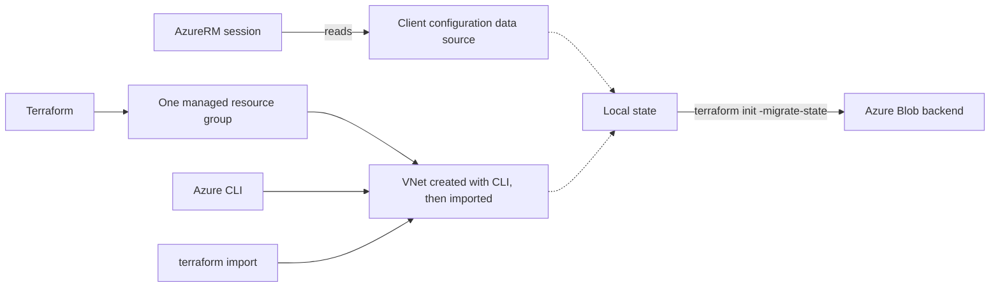

<!--
SPDX-FileCopyrightText: 2026 biro98
SPDX-License-Identifier: MIT
-->

# Lab 05 Reference Solution

This independent root implements the [step-by-step exercise](../INSTRUCTIONS.md):
create one group with Terraform, create a VNet with Azure CLI, import that VNet,
reconcile tag drift, then migrate local state to the supplied Azure Blob backend.
The client configuration data source reads the current subscription.

**Do not apply this configuration to state from the old two-resource-group
solution.** Keep that state and configuration intact and ask the instructor for
migration help, or use a separate fresh working directory and new dedicated
group. Removing the old imported group from configuration can otherwise plan its
destruction. Never delete state to hide a migration problem.

## Architecture



## Run the import and drift exercise

1. Use Terraform 1.14.5 or newer (below 2.0). Authenticate with the
   [VM or laptop setup](../../common/azure-authentication.md). The workshop
   preregisters providers; retain `resource_provider_registrations = "none"`.
2. Work from this `solution` directory. For a first run only, copy
   `terraform.tfvars.example` to `terraform.tfvars`. Set a unique suffix and new
   solution-owned group, distinct from the starter and platform groups. Never
   overwrite existing inputs. The sample location is `swedencentral`.
3. Follow the [parent instructions](../INSTRUCTIONS.md) from initialization through
   cleanup, **remaining in this directory** and substituting your solution's
   group, suffix, and VNet name for the starter examples.
4. Bootstrap only `azurerm_resource_group.this` with the guide's targeted plan and
   reviewed apply. Do not apply the full configuration yet: that would create
   the VNet before the CLI/import exercise.
5. Create `vnet-tf-lab05-<your-suffix>` with Azure CLI in that group, using
   `10.5.0.0/16` and tags `environment=training owner=network-team`.
   Import its exact Azure ID into `azurerm_virtual_network.this`; do not import
   another resource group.
6. Confirm the next plan has no changes. State contains the group, VNet, and
   `data.azurerm_client_config.current`. Outputs are `resource_group_name`,
   `virtual_network_id`, and `current_subscription_id`.
7. Perform the guide's CLI tag change, inspect the one in-place drift correction,
   then apply a newly reviewed plan to restore `owner=network-team`.

A fresh full plan would show two managed creates, but that is not the import
exercise. Do not copy the starter's state or manage the same Azure group from two roots.

From the repository root, open this reference with:

```powershell
Set-Location .\lab05-state-drift-import\solution
if (-not (Test-Path .\terraform.tfvars)) {
  Copy-Item .\terraform.tfvars.example .\terraform.tfvars
}
```

Edit the copied inputs and authenticate before proceeding. If state or an active
backend already exists, stop and establish where to resume; do not repeat creation
or import. For a fresh run, the initial commands are:

```powershell
terraform init
terraform fmt -check
terraform validate
terraform plan
terraform plan "-target=azurerm_resource_group.this" "-out=rg-bootstrap.tfplan"
terraform show rg-bootstrap.tfplan
```

The full preview must show two creates. The saved bootstrap plan must show only
one RG create. Only after checking it, run `terraform apply rg-bootstrap.tfplan`,
then continue with the [CLI creation, import, and drift steps](../INSTRUCTIONS.md#4-create-the-vnet-with-azure-cli-then-import-it)
using your solution's names (the example uses suffix `ref05`).
Quote complete `-target=...`, `-out=...`, and `-backend-config=...` arguments as
shown to prevent PowerShell argument-splitting errors.

## Remote backend and cleanup

Only after the local-state exercise, copy `backend.tf.example` to `backend.tf` and
`backend.hcl.example` to `backend.hcl` if they do not already exist. Fill in the
supplied platform storage, tenant, and subscription values following the
[backend steps](../INSTRUCTIONS.md). Do not create backend storage in the lab group.
Keep the solution's separate key `lab05-solution.tfstate`. Confirm the container
is reachable using Entra authentication and the destination blob is not owned by
another deployment. The identity running Terraform needs **Storage Blob Data
Contributor** on the container to write and lock state; Blob Data Reader only
allows viewing. Neither role bypasses storage network restrictions.

Keep a private backup before migrating:

```powershell
Copy-Item .\terraform.tfstate ".\terraform.tfstate.pre-migration-$(Get-Date -Format yyyyMMdd-HHmmss).backup"
```

The supplied backend template is for the workshop VM. **On a laptop**, edit only
your local `backend.hcl`: use `use_msi = false`, `use_cli = true`, and retain
`use_azuread_auth = true`, with your approved tenant/subscription/storage values.
Authenticate following the [non-VM setup](../../common/azure-authentication.md#running-without-the-workshop-vm).
Do not enable a backend until access works. Then run:

```powershell
terraform init -migrate-state "-backend-config=backend.hcl"
terraform state list
terraform plan
```

Confirm the migration prompt only after checking source state, destination, and
key; verify all three state addresses and a no-change plan afterwards.
The template explicitly uses VM managed identity (`use_msi`) and Microsoft Entra
Blob authorization (`use_azuread_auth`), not storage access keys. For a laptop,
use the [non-VM backend alternative](../../common/azure-authentication.md#running-without-the-workshop-vm);
do not try VM MSI from a laptop.

To finish, save and inspect a fresh cleanup plan:

```powershell
terraform plan -destroy "-out=cleanup.tfplan"
terraform show cleanup.tfplan
```

Expect **0 to add, 0 to change, 2 to destroy**: only the VNet and solution group,
not the subscription or external backend storage. Ensure the group contains no
unrelated resources. Only when ready to delete them, run:

```powershell
terraform apply cleanup.tfplan
terraform state list
```

Confirm the group no longer exists in Azure and the state list is empty. The
remote state blob remains in the container. **Deleting the group deletes everything
inside it.** Keep backend settings and state/backups until cleanup is verified.
Never reapply a historical plan or reimport an already-managed VNet.
Real backend settings, private inputs, state, backups, plans, caches, and local
overrides are intentionally not included in the published solution.
