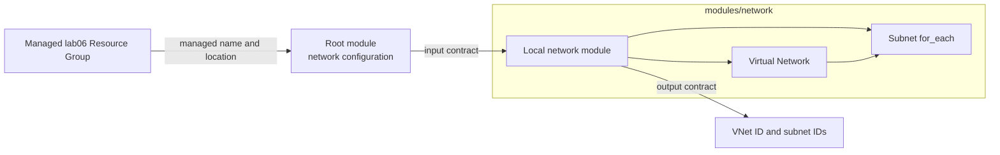

<!--
SPDX-FileCopyrightText: 2026 biro98
SPDX-License-Identifier: MIT
-->

# Lab 06 - Build a Custom Terraform Module

**Estimated difficulty:** Intermediate | **Estimated time:** 100 minutes

Start with [INSTRUCTIONS.md](INSTRUCTIONS.md) for the complete beginner walkthrough, exact child input types, resource arguments and output expressions. This README explains the concepts; run the exercise once, not once per document.

## Learning objectives

Distinguish root and child modules, define an input/output contract, use a local module source, and discuss encapsulation and module versioning.

## Scenario

The bank network platform team wants one approved interface for a VNet and its subnets. Application teams supply configuration; the module owns implementation.

## Architecture



Inputs flow into the module; Azure resources are hidden behind the contract; outputs flow back to the caller. Treat this as an infrastructure API.

## Supplied inputs

Copy `terraform.tfvars.example` to `terraform.tfvars` only if it does not already exist. Choose a new `resource_group_name` unique to this lab/state (example `rg-tf-lab06-u01`), set `location` to an approved region such as `swedencentral`, and personalize `unique_suffix`. Keep the suffix consistent in group/VNet names. The root creates the group and supplies its name/location to the child. Preserve the example's subnet ranges for the first deployment; this lab builds a local module, not an AVM.

This root creates its own group and passes its name and location to the network module. Both root and child declare a location input; the child does not create a second group. Keep the `vnet-tf-lab06-` name prefix. Starter and reference states must use distinct groups and suffixes, or destroy the first deployment before reusing names.

## Key concepts

- A **root module** is the folder where you run Terraform. It creates the lab resource group with `azurerm_resource_group.this` and calls the child.
- A **child module** is a folder of Terraform files used by another module. Here, `modules/network/variables.tf` defines inputs, `main.tf` implements resources, and `outputs.tf` returns results.
- The module block is the caller. Values flow into the child as arguments; results return through `module.network.<output_name>`.
- The **contract** is the set of inputs and outputs. Expose values consumers genuinely need to vary; hide internal resource details.
- Module-owned state addresses start with `module.network`, for example `module.network.azurerm_subnet.this["application"]`.
- A local path such as `./modules/network` has no registry version. Published modules should use an intentional version constraint and reviewed upgrades.

## Prerequisites

On the workshop VM, bootstrap configures `ARM_USE_MSI=true`, `ARM_SUBSCRIPTION_ID`, and `ARM_TENANT_ID` for Terraform. Open a fresh PowerShell session if needed. Use `az login --identity` for CLI commands; do not sign in with a user, tenant/device flow, or client secret. Provider and backend authentication are separate. To refresh the current shell's ARM variables and CLI identity login, run `& "C:\Program Files\TerraformWorkshop\Connect-WorkshopAzure.ps1"`.

On a laptop, follow the separate [workstation authentication path](../common/azure-authentication.md#running-without-the-workshop-vm); neither the VM helper nor identity login works there.

The VM identity has Contributor at subscription scope so Terraform can create lab groups. Your VM setup registers required providers in your subscription; retain `resource_provider_registrations = "none"`. No earlier lab state is required.

Use the lab-specific inputs above. Terraform creates `azurerm_resource_group.this`; the child module receives its name and location.

Each Azure lab owns a different resource group. Never use the VM/platform group, another lab's group, or any pre-existing shared group. Starter and reference roots have separate states: use distinct group names and suffixes (the reference examples do), or destroy the first deployment before reusing names. A different suffix alone does not isolate a shared group or canonical DNS zone.

**Existing-state safety:** These instructions assume a fresh dedicated lab deployment. If an older state used a shared or instructor-created group, stop and back up state securely. Coordinate migration with the instructor before changing group names or running apply/destroy. Do not import the shared group, remove ownership blindly, or reuse an old plan; changing group/location can replace resources.

## Files included

The root standard files plus `modules/network/{main,variables,outputs}.tf`. The published [reference solution](solution/README.md) includes its own complete child module. Attempt the starter instructions first; the solution is an independent Terraform root and state.

## Tasks

1. Define the child module's typed variables.
2. Create its VNet and keyed subnets.
3. Expose VNet and subnet IDs.
4. Call the module from root and expose its outputs.
5. Deploy, then add a management subnet through tfvars without changing module internals.

## Commands to execute

Complete the child implementation, root call and outputs first. Run these from the Lab 06 root, never from `modules/network`. See the instructions for saved-plan review and the second subnet-change plan.

```powershell
if (-not (Test-Path .\terraform.tfvars)) {
  Copy-Item .\terraform.tfvars.example .\terraform.tfvars
}
terraform init
terraform fmt -recursive
terraform validate
terraform plan -out main.tfplan
terraform show main.tfplan
# Continue only after reviewing the four-resource initial plan.
terraform apply main.tfplan
terraform state list
```

During init, notice Terraform discovers the local module. In state, identify the `module.network` address prefix. After adding a subnet input, verify only one keyed resource is added.

Guided checkpoints:

1. Complete the child input types before writing resources.
2. Implement the child VNet and subnet loop. Root validation cannot check the child until a module call includes it.
3. Pass root values through the module block; do not read root variables directly from the child.
4. Expose child results, then re-expose only useful results as root outputs. Run `init`, recursive formatting and `validate` now that the child is connected.
5. Add the management input and confirm that only one module-owned subnet is added.

## Validation steps

Confirm module outputs contain the VNet and every subnet, Azure contains the expected prefixes, and the post-apply plan is empty.

## Expected result

The root creates the managed resource group and calls a reusable network module that owns one VNet and multiple subnets in that group's region. Initially expect four managed resources; adding management produces one additional subnet. Both root and child resources are recorded in the root's single state.

## Questions for discussion

1. What is the contract between root and child module?
2. Which implementation details should a consumer not need to know?
3. How would a registry version constraint change module distribution?

## Cleanup

Review `terraform plan -destroy` in the state that owns this deployment, then run `terraform destroy`. **This deletes the lab resource group and its contents**, not only the resources listed in this root. AzureRM may refuse deletion when unmanaged contents remain; inspect them rather than disabling that safety check. Never put unrelated resources in this group. Verify `az group exists --name "rg-tf-lab06-u01"` returns `false` (use your actual name). Other labs' distinct groups and the platform VM/backend storage must remain. Keep local inputs, state, plans, and populated backend files out of Git.

## Optional challenge

Add an optional tags input and a validation that every subnet prefix is inside the VNet CIDR. Decide whether all AzureRM arguments should be exposed to consumers.

## Common mistakes

| Problem | Fix |
| --- | --- |
| Module is not installed | Run `terraform init` again after adding or changing a module source. |
| Root cannot access a child resource directly | Add a child output and read it through `module.network.<output>`. |
| Child cannot find a root variable | Declare a child input and pass the root value in the module block. |
| Formatting misses child files | Use `terraform fmt -recursive`. |
