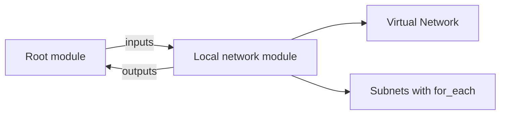

<!--
SPDX-FileCopyrightText: 2026 biro98
SPDX-License-Identifier: MIT
-->

# Lab 06 Reference Solution

This independent root contains a complete local child module. Its contract is intentionally small.

## Architecture



## Run and inspect the module

Use Terraform 1.14.5 or newer (below 2.0) and the
[VM or laptop authentication setup](../../common/azure-authentication.md).
Keep the workshop's `resource_provider_registrations = "none"` setting.

Work in this `solution` directory, not `modules/network`. On the first run only,
copy `terraform.tfvars.example` to `terraform.tfvars`. Edit a dedicated group and
unique suffix distinct from the starter and platform groups. Do not overwrite
existing inputs; keep the current group, suffix, and location for an existing
deployment. The sample uses Sweden Central.

```powershell
terraform init
terraform fmt -recursive
terraform validate
terraform plan -out main.tfplan
terraform show main.tfplan
```

Expect four creates from fresh state: the root group, the child VNet, and two
child subnets. Follow the [module walkthrough](../INSTRUCTIONS.md) to trace the
five inputs (`name`, `location`, `resource_group_name`, `address_space`, `subnets`)
and the `vnet_id`/`subnet_ids` outputs. The root passes the managed group's name
and location and reexports the two module outputs.

Review before `terraform apply main.tfplan`, then run `terraform state list`
and `terraform output`. Subnets use stable addresses under
`module.network.azurerm_subnet.this["application"]` and `["data"]`.
Add `management = { address_prefix = "10.6.3.0/24" }` to the existing input map,
keeping both existing entries. The next plan should add one subnet only.

The child now follows the guide's literal `snet-${each.key}` naming. Old custom
keys containing underscores may change Azure names; review replacement plans
before applying. The supplied `application`/`data` names are unchanged.

Review `terraform plan -destroy` before `terraform destroy`.
**Cleanup deletes the solution group and its contents.** Never share it with
unrelated resources. Keep private inputs, credentials, plans, and state out of Git.
