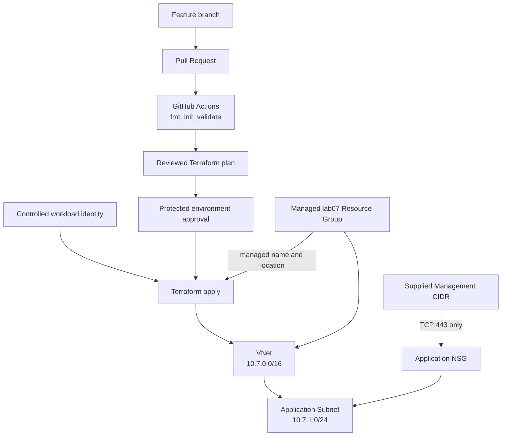

<!--
SPDX-FileCopyrightText: 2026 biro98
SPDX-License-Identifier: MIT
-->

# Lab 07 - Enterprise Terraform Practices

**Estimated difficulty:** Intermediate | **Estimated time:** 100 minutes

Start with [INSTRUCTIONS.md](INSTRUCTIONS.md) for the beginner repair sequence, exact CIDR changes, NSG association, required YAML completion, optional Git/PR example and expected plan counts. This README is reference material; do not execute both guides as separate deployments.

## Learning objectives

Diagnose formatting, validation, design, and security defects; constrain versions; build a credential-free Pull Request validation workflow; and explain reviewed plan/apply delivery with controlled automation identities.

## Scenario

A proposed bank network change has failed pre-merge checks. Act as reviewer, repair the eight documented intentional issues, add the required subnet/NSG association, and build a small GitHub Actions workflow that rejects incorrectly formatted or invalid Terraform before review.

## Architecture



The repaired network is intentionally small; the enterprise lesson is the controlled path from reviewed source to an authenticated apply.

## Supplied inputs

Copy `terraform.tfvars.example` to `terraform.tfvars` only if it does not already exist. Choose a new `resource_group_name` unique to this lab/state (example `rg-tf-lab07-u01`), set `location` to an approved region such as `swedencentral`, and personalize `unique_suffix`. Preserve the management CIDR example or use the instructor-approved source; it is not automatically your laptop's range. This lab does not use AVM.

Create the dedicated group with Terraform. Keep the `vnet-tf-lab07-` and `nsg-lab07-` name prefixes. Starter and reference have separate states: use distinct group names and suffixes, or destroy one deployment before reusing its names.

## Key concepts

- `terraform fmt` enforces canonical formatting; `terraform validate` checks syntax, types, and references.
- Validation does not prove Azure permissions, quotas, policy compliance, security, or runtime connectivity. Those require planning, scanners, policy, review, and testing.
- Version constraints define allowed releases. `.terraform.lock.hcl` records the selected provider versions so developers and CI use the same dependency set. Production repositories normally commit it; this training repository ignores student-generated lock files to avoid exercise-specific churn.
- A saved plan is review evidence. Review action counts, replacements, CIDRs, names, inbound sources, sensitive values, and unexpected modules before approval.
- Continuous integration (CI) automatically checks each proposed change. The lab workflow needs no Azure credentials because formatting, backend-free initialization, and static validation do not call Azure APIs.
- Continuous delivery or deployment (CD) extends CI with an authenticated plan or apply. That requires remote state, OIDC, least-privilege RBAC, protected environments, and approval controls, so this introductory exercise discusses CD without deploying from GitHub Actions.
- OIDC workload identity exchanges a short-lived CI token for Azure access. It avoids storing a long-lived client secret in the repository or CI platform.

## Prerequisites

On the workshop VM, bootstrap configures `ARM_USE_MSI=true`, `ARM_SUBSCRIPTION_ID`, and `ARM_TENANT_ID` for Terraform. Open a fresh PowerShell session if needed. Use `az login --identity` for CLI commands; do not sign in with a user, tenant/device flow, or client secret. Provider and backend authentication are separate. To refresh the current shell's ARM variables and CLI identity login, run `& "C:\Program Files\TerraformWorkshop\Connect-WorkshopAzure.ps1"`.

Static local checks and GitHub CI need no Azure identity. When you reach the local plan/apply phase on a laptop, use the [workstation authentication path](../common/azure-authentication.md#running-without-the-workshop-vm) instead of the VM helper.

The VM identity has Contributor at subscription scope so Terraform can create lab groups. Your VM setup registers required providers in your subscription; retain `resource_provider_registrations = "none"`. No earlier lab state is required.

Use the lab-specific inputs above. Terraform creates `azurerm_resource_group.this`; network resources use its name and location.

Each Azure lab owns a different resource group. Never use the VM/platform group, another lab's group, or any pre-existing shared group. Starter and reference roots have separate states: use distinct group names and suffixes (the reference examples do), or destroy the first deployment before reusing names. A different suffix alone does not isolate a shared group or canonical DNS zone.

**Existing-state safety:** These instructions assume a fresh dedicated lab deployment. If an older state used a shared or instructor-created group, stop and back up state securely. Coordinate migration with the instructor before changing group names or running apply/destroy. Do not import the shared group, remove ownership blindly, or reuse an old plan; changing group/location can replace resources.

## Files included

Standard files with labeled intentional defects and a guided `pipeline-example.yml`. The published [reference solution](solution/README.md) includes the corrected independent configuration and completed workflow template. Attempt the starter first; installing the workflow and opening a PR remain optional.

## Tasks

1. Inventory the labeled issues before editing.
2. Add Terraform and provider constraints; fix the management CIDR type and declare required variables.
3. Fix formatting, the missing reference, VNet name, and invalid subnet CIDR.
4. Replace the broad rule with TCP 443 from `management_source_cidr`.
5. Run checks and review a saved plan as if it were a Pull Request artifact.
6. Complete the four TODOs in `pipeline-example.yml` to create a credential-free Pull Request validation workflow.
7. **Optional:** copy the completed workflow to the repository-level `.github/workflows` folder, commit it on a branch, and inspect the check on a Pull Request. Writing the YAML and running its Terraform checks locally are sufficient for the required pipeline exercise.

Use this eight-issue checklist without opening the solution:

1. Inconsistent formatting in `main.tf`.
2. Missing Terraform and AzureRM version constraints.
3. Incorrect type for `management_source_cidr`.
4. Missing declaration for `unique_suffix`.
5. Hardcoded VNet name instead of the supplied suffix.
6. Invalid VNet reference in the subnet.
7. Subnet CIDR outside the VNet.
8. Overly broad management rule instead of TCP 443 from `management_source_cidr`.

The starter deliberately contains a formatting defect. Repair it while retaining the managed resource group and its location input, and keep formatting clean during subsequent changes.

For issue 7, change **both** the VNet to `10.7.0.0/16` and the subnet to `10.7.1.0/24`. Keeping the starter's VNet `/24` would still exclude the corrected subnet. Add the subnet/NSG association as shown in the instructions; expect five managed creates after all repairs. The restricted custom rule does not remove Azure's default NSG rules or establish an HTTPS-only isolation policy.

## Commands to execute

```powershell
if (-not (Test-Path .\terraform.tfvars)) {
  Copy-Item .\terraform.tfvars.example .\terraform.tfvars
}
terraform fmt -check
terraform init
terraform validate
# Stop here and complete the version/input/network repairs in INSTRUCTIONS.md.
terraform fmt
terraform validate
terraform plan -out main.tfplan
terraform show main.tfplan
```

Initial formatting and validation checks should fail for known reasons; initialization may succeed. After repairs, distinguish static validation from Azure/API design validation. Confirm the custom management rule is restricted and the plan creates only this lab's dedicated group and intended network. Associate the repaired NSG with the application subnet before applying so the rule is effective.

## CI/CD exercise: Pull Request validation with GitHub Actions

Complete `pipeline-example.yml` so it:

1. Runs on Pull Requests that change `lab07-enterprise-practices/**` or `.github/workflows/terraform-lab07-ci.yml`, and supports a manual run (normally available once installed on the default branch).
2. Grants only `contents: read`; do not add `id-token: write` because this workflow does not authenticate to Azure.
3. Uses `lab07-enterprise-practices` as the working directory.
4. Runs `terraform fmt -check -recursive`, `terraform init -backend=false`, and `terraform validate` as separate named steps.

Writing the YAML is required; installing or executing it in GitHub is optional.
Run the three Terraform commands locally and explain the YAML's triggers,
permissions, working directory, and steps. Local checks do not prove GitHub
execution, but no PR or provisioned runner is required to complete this lab.

### Optional: install and run the workflow

Only with an approved repository, Actions enabled, and runner access, place the
completed workflow where GitHub Actions can discover it. The template uses the
GitHub-hosted `ubuntu-latest` runner, not a self-hosted runner; organization policy
and usage limits may still prevent execution.

```powershell
New-Item -ItemType Directory -Force ..\.github\workflows
Copy-Item .\pipeline-example.yml ..\.github\workflows\terraform-lab07-ci.yml
```

Commit the workflow on a branch and open a Pull Request. A formatting or validation defect should make the check fail; correcting the defect and pushing again should make it pass.

This is the **CI** portion of CI/CD. A production **CD** stage would add an Azure-authenticated plan and an approved apply using OIDC, remote state, least-privilege RBAC, and environment protection. Do not add those elements to this beginner exercise.

Static CI needs no variable values or Azure access. Future authenticated plan/apply must receive `TF_VAR_resource_group_name`, `TF_VAR_location`, and `TF_VAR_unique_suffix`, and own a dedicated group through one controlled state. GitHub-hosted runners cannot use the VM's MSI environment: use a separately configured OIDC identity with permission to create the deployment group. Never let CI state compete with local state.

## Validation steps

Require clean `terraform fmt -check`, successful backend-disabled initialization and `terraform validate`, a reviewed plan, and a completed/reviewed pipeline YAML. A `Lab 07 Terraform CI` Pull Request check is optional, not a completion requirement. If attempted, record its outcome; otherwise record CI as not run. Optionally run TFLint and Checkov. Verify version selections in `.terraform.lock.hcl` and ensure no secret or state is staged by Git.

## Expected result

The corrected network deploys with bounded versions and a narrowly scoped management rule. The completed YAML describes automatic formatting and static validation checks without Azure credentials. If the optional workflow is installed and Actions is available, Pull Requests that change Lab 07 run those checks.

## Enterprise workflow

```text
Developer -> branch -> Pull Request
  -> fmt/check -> validate -> lint -> security -> plan
  -> review/approval -> controlled apply identity
```

Plan and apply are separate trust decisions. CI should use workload identity federation or a service principal with least privilege, never a developer login or committed secret. Policy and security scanners provide additional governance, not automatic correctness.

## Questions for discussion

1. Why constrain providers and commit reviewed lock files in real repositories?
2. Why should the apply identity commonly have more privilege than the plan job?
3. Which defects can `validate` miss, and where do policy and review help?

## Cleanup

Review `terraform plan -destroy` in the state that owns this deployment, then run `terraform destroy`. **This deletes the lab resource group and its contents**, not only the resources listed in this root. AzureRM may refuse deletion when unmanaged contents remain; inspect them rather than disabling that safety check. Never put unrelated resources in this group. Verify `az group exists --name "rg-tf-lab07-u01"` returns `false` (use your actual name). Other labs' distinct groups and the platform VM/backend storage must remain. Keep local inputs, state, plans, and populated backend files out of Git.

## Optional challenge

Extend the workflow with TFLint or a policy scanner. As a separate design exercise, identify the OIDC, remote-state, RBAC, environment-approval, and plan-artifact controls required before adding authenticated plan or apply jobs. Do not add credentials.

## Common mistakes

| Problem | Fix |
| --- | --- |
| The first validation fails | Expected: inventory all intentional issues before repairing them. |
| Validation passes but the design is insecure | Static validation cannot judge least privilege; use the plan-review checklist. |
| Provider versions differ between machines | In a production repository, commit and review `.terraform.lock.hcl`; do not delete it to fix unrelated errors. |
| GitHub does not discover the workflow | The completed YAML file must be under the repository-level `.github/workflows/` directory, not inside the lab directory. |
| CI requests Azure credentials | Remove plan/apply and Azure login steps; this exercise uses only credential-free static checks. |
| Pipeline asks for a client secret | Configure OIDC federation and least-privilege Azure RBAC instead of committing credentials. |
