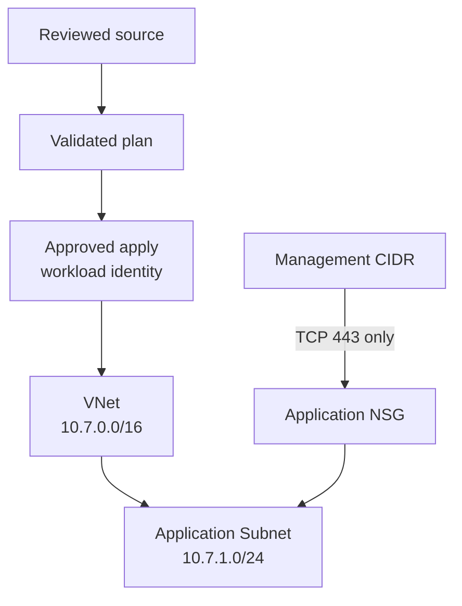

<!--
SPDX-FileCopyrightText: 2026 biro98
SPDX-License-Identifier: MIT
-->

# Lab 07 Reference Solution

This independent root resolves every labeled issue. Compare behavior and review posture, not only text.

`pipeline-example.yml` is the completed credential-free GitHub Actions exercise. Writing and reviewing the YAML and running its Terraform checks locally are required; installing it and opening a PR are optional. To optionally test it in GitHub, copy it to the repository-level `.github/workflows/terraform-lab07-ci.yml` path; GitHub does not discover workflows inside a lab or solution directory.
It intentionally validates the repaired **starter at the lab root**, not this
solution folder. Complete the starter fixes before testing the workflow.
It runs Terraform 1.14.5, format checking, backend-disabled init, and validation;
it does not authenticate to Azure, plan, or apply.

## Architecture



## Run the corrected configuration

Use Terraform 1.14.5 or newer (below 2.0) and the
[VM or laptop authentication setup](../../common/azure-authentication.md).
Keep `resource_provider_registrations = "none"` for the workshop.
In this `solution` directory, copy `terraform.tfvars.example` to `terraform.tfvars`
on the first run only. Do not overwrite existing inputs.
Choose a unique suffix and dedicated group, distinct from the starter and
platform/shared groups. The sample uses Sweden Central. Set
`management_source_cidr` to the intended management range, not unrestricted
Internet access. Preserve current names/location if using existing state.

```powershell
terraform init -upgrade
terraform fmt -check -recursive
terraform validate
terraform plan "-out=main.tfplan"
terraform show main.tfplan
```

Expect five creates from fresh state: group, VNet (`10.7.0.0/16`), subnet
(`10.7.1.0/24`), NSG, and association. The `Allow-Management` rule permits inbound
TCP 443 from the input CIDR. The association attaches that NSG to the subnet.
Azure's default NSG rules remain; this is not a complete HTTPS-only isolation policy.

After review, run `terraform apply main.tfplan` and `terraform output vnet_id`.
A `moved` block preserves the previous association address `this` as
`application`; the old explicit HTTPS rule name is updated in place to the
guide's `Allow-Management`. Review all changes against existing state.

Optionally follow the [CI steps](../INSTRUCTIONS.md) to install the workflow in your fork,
open the PR, and intentionally fail then fix formatting, if Actions and a runner
are available. The template uses GitHub-hosted `ubuntu-latest`; no self-hosted
runner provisioning is required. PR changes to either
the lab or workflow file trigger CI; manual dispatch is also supported.
The architecture diagram shows a conceptual reviewed deployment, not an apply
job in the supplied workflow.

Review `terraform plan -destroy` before `terraform destroy`.
**Cleanup deletes this group and its contents.** Keep credentials, private input
values, state, and plans out of Git.
