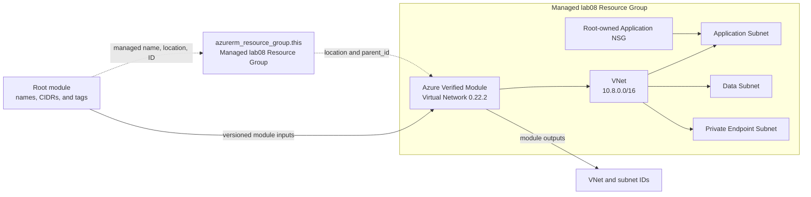

<!--
SPDX-FileCopyrightText: 2026 biro98
SPDX-License-Identifier: MIT
-->

# Lab 08 - Azure Verified Modules

**Estimated difficulty:** Intermediate | **Core time:** 60 minutes | **Extension:** 30 minutes

Follow [INSTRUCTIONS.md](INSTRUCTIONS.md) as the primary walkthrough. It provides
exact file edits, small code blocks, explanations, and stop/check points without
requiring the solution folder. This README is reference material, not a second
deployment sequence.

## Learning objectives

Find an AVM source and version, read required and optional inputs, compose raw AzureRM resources with AVM, consume outputs, inspect ownership through state addresses, and explain the progression from raw resources to governed modules.

## Scenario

The network platform team wants Microsoft-maintained Azure Verified Modules as a standardized foundation instead of rebuilding common VNet behavior.

## Architecture



The progression is `raw azurerm resources -> custom module -> Azure Verified Module`. AVM removes repeated implementation from the root but does not remove consumer responsibility for addressing, naming, security, version upgrades, or plan review.

## Supplied inputs

Copy `terraform.tfvars.example` to `terraform.tfvars` only if the destination does not exist. Choose a new `resource_group_name` unique to this lab/state (example `rg-tf-lab08-u01`), set `location` to an approved region (the sample uses `swedencentral`), and personalize `unique_suffix`. Keep the suffix consistent in explicit group/VNet names. The managed group supplies network resource names/locations and AVM parent IDs. Preserve the example's network ranges and policy inputs unless the exercise asks you to change them. Do not overwrite existing inputs or change an existing deployment's region just to match the sample.

Keep `lab08` in VNet and NSG names (for example, `nsg-application-tf-lab08-${var.unique_suffix}`). Starter and reference have separate states: their examples use distinct groups and suffixes. Never let both manage the same Azure resources; destroy the active deployment before reusing its names.

## Key concepts

- An **Azure Verified Module (AVM)** is a Microsoft-aligned reusable module with a documented interface, tests, and versioned releases. It is still code that must be reviewed and pinned.
- Read the matching interface at [Terraform Registry: AVM Virtual Network 0.22.2](https://registry.terraform.io/modules/Azure/avm-res-network-virtualnetwork/azurerm/0.22.2), rather than the latest version's interface.
- `source` identifies the module and `version = "0.22.2"` pins the tested release. Do not use `latest` implicitly in production.
- `parent_id = azurerm_resource_group.this.id` connects the AVM-managed VNet to the root-owned resource group and orders VNet creation after group creation.
- The root owns the application NSG policy; the AVM owns the VNet and subnets. Passing the NSG ID through the subnet object composes those ownership boundaries.
- AVM uses transitive providers such as AzAPI, modtm, and random internally. Terraform discovers them during `init`; do not edit downloaded files under `.terraform/modules`.

The important subnet input shape is:

```hcl
application = {
    name                   = "snet-application"
    address_prefixes       = ["10.8.1.0/24"]
    network_security_group = { id = azurerm_network_security_group.application.id }
}
```

## Prerequisites

On the workshop VM, bootstrap configures `ARM_USE_MSI=true`, `ARM_SUBSCRIPTION_ID`, and `ARM_TENANT_ID` for Terraform. Open a fresh PowerShell session if needed. Use `az login --identity` for CLI commands; do not sign in with a user, tenant/device flow, or client secret. Provider and backend authentication are separate. To refresh the current shell's ARM variables and CLI identity login, run `& "C:\Program Files\TerraformWorkshop\Connect-WorkshopAzure.ps1"`.

The VM identity has Contributor at subscription scope so Terraform can create lab groups. Your VM setup registers required providers in your subscription; retain `resource_provider_registrations = "none"`. No earlier lab state is required.

Set `resource_group_name` to a new group unique to this lab/state (example `rg-tf-lab08-u01`), `location` to an allowed Azure region (example `swedencentral`), and `unique_suffix` to your own suffix. Keep the group name and suffix consistent with the example, and update any explicit VNet name too. Terraform creates `azurerm_resource_group.this`; network resources use its name/location and AVM uses its ID.

Each Azure lab owns a different resource group. Never use the VM/platform group, another lab's group, or any pre-existing shared group. Starter and reference roots have separate states: use distinct group names and suffixes (the reference examples do), or destroy the first deployment before reusing names. A different suffix alone does not isolate a shared group or canonical DNS zone.

**Existing-state safety:** These instructions assume a fresh dedicated lab deployment. If an older state used a shared or instructor-created group, stop and back up state securely. Coordinate migration with the instructor before changing group names or running apply/destroy. Do not import the shared group, remove ownership blindly, or reuse an old plan; changing group/location can replace resources.

## Files included

The standard files contain the resource group and TODOs for security, the AVM call,
and outputs. The guided instructions explain how to complete them. The instructor
reveals `solution/` on demand; it is not included in the starter checkout. The
walkthrough and reference use AVM release `0.22.2`.

## Tasks

1. Open the Terraform Registry and GitHub documentation for `Azure/avm-res-network-virtualnetwork/azurerm`.
2. Identify source, version, Terraform requirement, required inputs, subnet object shape, outputs, examples, and release notes.
3. Create a root-owned application NSG with TCP 443 allowed only from `management_cidr`.
4. Implement the pinned module call and multiple subnets; pass the NSG ID through the application subnet object.
5. Complete the root outputs, then deploy and inspect `module.virtual_network.resource_id`, `module.virtual_network.subnets`, and the root-owned NSG state address. See [INSTRUCTIONS.md](INSTRUCTIONS.md#5-finish-outputs-initialize-and-review) for output names and value references.
6. As a **plan-only** experiment, change the data prefix to `10.8.4.0/24`, inspect the plan, then restore `10.8.2.0/24` and verify no changes. Do not apply the experiment.

## Commands to execute

Use these only after completing the code in the instructions. Initial validation
of the RG-only starter is not evidence that the lab is complete.

```powershell
if (-not (Test-Path .\terraform.tfvars)) {
  Copy-Item .\terraform.tfvars.example .\terraform.tfvars
}
terraform init
terraform fmt
terraform validate
terraform providers
terraform plan "-out=main.tfplan"
terraform show main.tfplan
```

Stop and review the plan against the instructions' inventory before running:

```powershell
terraform apply main.tfplan
terraform output
terraform state list
```

During init, observe transitive AzAPI, modtm, and random providers selected by AVM. In state, identify resources under `module.virtual_network`. Do not edit downloaded code under `.terraform/modules`.

Guided checkpoints:

1. Read the Registry inputs and outputs before writing the module block.
2. Create the dedicated group and lab08-named application NSG, using the managed group's name and location.
3. Transform the supplied subnet map into the AVM subnet object shape.
4. Pass the NSG ID only to the application subnet.
5. Use AVM outputs rather than reconstructing Azure resource IDs.
6. Review module-internal plan actions before apply; using AVM does not remove plan-review responsibility.

## Validation steps

Confirm three subnet outputs, the VNet's `10.8.0.0/16` address space, the application NSG association, disabled private endpoint policies on the intended subnet, and an empty post-apply plan.

## Expected result

The managed lab resource group contains this lab's AVM-managed VNet and three subnets isolated from all other labs. The root owns the group and security policy, and supplies its NSG ID through the AVM contract.

## Questions for discussion

1. What code did AVM remove, and what responsibility remains with the consumer?
2. Why pin module versions and read upgrade notes before changing them?
3. When should an organization wrap AVM in its own internal guardrail module?
4. Should every possible AVM input be exposed to application teams?

## Cleanup

Follow the [cleanup checkpoint](INSTRUCTIONS.md#cleanup): capture the group output,
run `terraform plan -destroy "-out=cleanup.tfplan"`, inspect it, then apply only
that reviewed plan. **This deletes the lab group and its contents.** Saved-plan
apply does not ask for confirmation. Keep state until the state list is empty
and Azure confirms the group no longer exists. Never disable safeguards to
delete unrelated contents; other labs and the VM/backend platform must remain.

## Optional challenge

Add a second NSG with a different rule collection for the data subnet. Decide whether repeated security policy belongs in this root, a dedicated security module, or an internal wrapper around AVM.

## Common mistakes

| Problem | Fix |
| --- | --- |
| Terraform reports module not installed | Run `terraform init` after adding or changing the module block. |
| AVM rejects the subnet value | Match the documented nested object shape and use a list for `address_prefixes`. |
| Application subnet has no NSG | Pass `{ id = azurerm_network_security_group.application.id }` through that subnet input. |
| A module upgrade changes the plan unexpectedly | Restore the tested pin, read release notes, and test the upgrade in a branch. |
