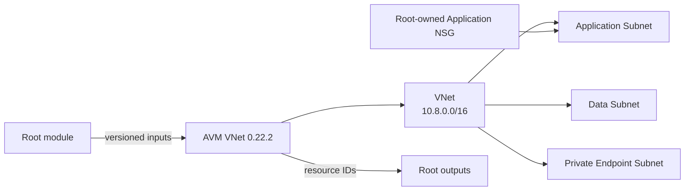

<!--
SPDX-FileCopyrightText: 2026 biro98
SPDX-License-Identifier: MIT
-->

# Lab 08 Reference Solution

This independent root pins [AVM VNet 0.22.2](https://registry.terraform.io/modules/Azure/avm-res-network-virtualnetwork/azurerm/0.22.2) and passes a root-owned application NSG through the AVM subnet contract. Review release notes before changing that version.

It completes [the attendee instructions](../INSTRUCTIONS.md): one dedicated managed group, one VNet, three subnets, one application NSG, and one scoped HTTPS rule. Only `application` receives the NSG; only `private_endpoints` disables private endpoint network policies. Azure's built-in NSG rules remain; the custom rule is not a deny-all policy. No compute or private endpoint is deployed. Telemetry is disabled.

## 1. Prepare the independent root

From the repository root in PowerShell, capture its path:

```powershell
$repoRoot = (Get-Location).Path
```

On the workshop VM, refresh authentication in this terminal **before** entering
the solution directory; the helper changes the current directory:

```powershell
& 'C:\Program Files\TerraformWorkshop\Connect-WorkshopAzure.ps1'
az account show --output table
```

For a laptop, follow [workstation authentication](../../common/azure-authentication.md#running-without-the-workshop-vm) instead; do not run the VM helper. Keep credentials/subscription IDs out of source. Provider registration stays `none`; bootstrap registers required providers. Backend authentication is separate.

Then enter the solution directory using the captured repository path:

```powershell
Set-Location (Join-Path $repoRoot 'lab08-azure-verified-modules\solution')
if (-not (Test-Path terraform.tfvars)) {
    Copy-Item terraform.tfvars.example terraform.tfvars
}
Get-Location
```

Personalize `resource_group_name = "rg-tf-lab08-solution-u01"` and the matching `unique_suffix = "solution-u01"`. The example/default region is `swedencentral`; use an approved region. `203.0.113.10/32` is a documentation address, not a working client IP; use an approved scoped management CIDR, never an unrestricted source.

Use a new group dedicated to this state. Starter and solution are separate states and must not share names/groups. Never use another lab's group or the VM/platform group. Existing private inputs are not overwritten: add the new `resource_group_name` input deliberately. With old state, stop and securely back it up; coordinate migration before changing names/location or applying/destroying. The corrected NSG name may replace an older NSG. Never import a shared group or blindly remove state.

## 2. Initialize and validate

Use Terraform `>= 1.14.5, < 2.0.0` and AzureRM `~> 4.0`.

```powershell
terraform init
terraform fmt -check
terraform validate
```

Keep the `0.22.2` AVM pin and lock file; do not use `init -upgrade` or edit downloaded AVM/helper modules. Init composes AVM's subnet/interface helper modules and transitive providers. AVM owns subnet attachments; do not duplicate them with standalone association resources. Preserve local overrides/state/cache; inspect overrides because they can supersede the declared Terraform range.

To initialize without configuring a remote state backend, use `terraform init -backend=false` followed by `terraform validate`. Initialization still needs module/provider downloads on a fresh checkout; it does not migrate state or prove deployment readiness.

### Optional local contract test

After initialization, run:

```powershell
terraform test "-var-file=terraform.tfvars.example" "-filter=tests\contracts.tftest.hcl"
```

This test mocks every external provider while exercising the real pinned AVM and its subnet/interface helpers. Its test-only `apply` creates no Azure resources and uses test state, not deployment state. It checks group inputs, scoped HTTPS, subnet policies/NSG attachment, CIDRs, and outputs; it is not an Azure connectivity or permission test. Ordinary `terraform plan` and `terraform apply` do not run these tests automatically.

## 3. Review, deploy, and inspect (only when authorized)

```powershell
terraform plan -out main.tfplan
terraform show main.tfplan
terraform apply main.tfplan
terraform state list
terraform output
terraform plan
```

Review all actions before saved-plan apply, which does not prompt. Fresh state should propose only this lab's inventory and AVM helpers, with no changes/destroys. Regenerate plans after edits. Expect an empty post-apply plan and module addresses under `module.virtual_network`.

| Output | Meaning |
| --- | --- |
| `resource_group_name` | Managed dedicated group name. |
| `vnet_id` | AVM `resource_id`. |
| `subnets` | Complete AVM objects keyed by `application`, `data`, `private_endpoints`, not just ID strings. |
| `application_nsg_id` | Root-owned NSG ID. |

## 4. Cleanup safely

In this same owning root, review `terraform plan -destroy`, then run `terraform destroy` and type `yes` only after review. This deletes the dedicated group and its contents. Never add unrelated resources or disable AzureRM's unmanaged-content deletion safeguard. Verify empty `terraform state list` and `az group exists --name "<your-solution-group>"` returns `false`; keep state until deletion succeeds. Never delete another lab, VM, or backend group. Only source, example inputs and tests are published; keep private tfvars, state, plans, local overrides and backend configuration out of Git.

## Architecture


