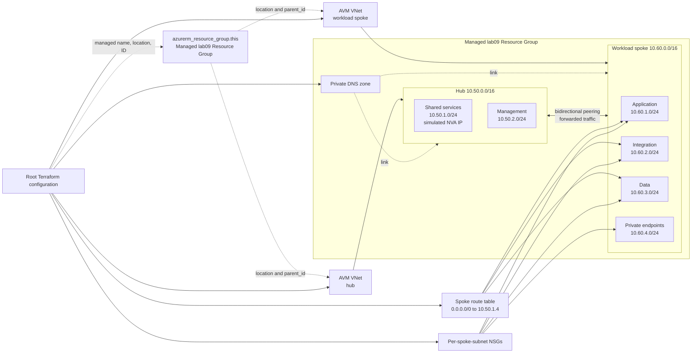

<!--
SPDX-FileCopyrightText: 2026 biro98
SPDX-License-Identifier: MIT
-->

# Lab 09 - Advanced Network Capstone

**Estimated difficulty:** Intermediate-advanced | **Core time:** 120 minutes | **Extension:** 30 minutes

Follow [INSTRUCTIONS.md](INSTRUCTIONS.md) as the primary walkthrough. It includes
the subnet-policy table, exact file edits, small code blocks, explanations, and
checkpoint commands. This README is architecture/reference material, not a
second deployment sequence.

## Learning objectives

Combine inputs, locals, loops, outputs, relationships, versioning, AVM composition, routing, peering, private DNS, plan review, and secure delivery. Assemble and explain the implementation one block at a time using the construction checkpoints in [INSTRUCTIONS.md](INSTRUCTIONS.md).

## Scenario

You are part of the network platform team of a bank. A new workload requires a hub-and-spoke network with centralized traffic inspection semantics, workload isolation, and shared private DNS. Build the pattern without deploying an expensive firewall or network virtual appliance (NVA).

## Architecture



The root composes raw AzureRM NSGs, routes, peerings, and DNS resources with two AVM VNet instances. NSG and route-table IDs cross the module boundary as spoke subnet inputs. The next-hop IP models a future central appliance; no appliance is deployed, so routed traffic will not successfully traverse that hop in this lab.

## Supplied inputs

Copy `terraform.tfvars.example` to `terraform.tfvars` only if the destination does not exist. Choose a new `resource_group_name` unique to this lab/state (example `rg-tf-lab09-u01`), set `location` to an approved region (the sample uses `swedencentral`), and personalize `unique_suffix`. Keep the suffix consistent in explicit group/VNet names. The managed group supplies network resource names/locations and AVM parent IDs. Preserve the example's network ranges and policy inputs unless the exercise asks you to change them. Do not overwrite existing inputs or change an existing deployment's region just to match the sample.

Include `lab09` in VNet, NSG, and route-table names, even when using the same suffix as another lab (for example, `nsg-application-tf-lab09-${var.unique_suffix}`). Child rules, peerings, and links are scoped to their lab-specific parents. The Blob DNS zone keeps the service-required name `privatelink.blob.core.windows.net`; Lab 09 alone owns this zone in this lab group.

Starter and reference use separate states and distinct example group names and suffixes. Never deploy both into the same group: the canonical DNS zone name cannot be isolated by a suffix. Separate groups isolate that zone as well as the networks; otherwise destroy the first deployment before reusing names.

| Input group | Purpose |
| --- | --- |
| `resource_group_name` | Names the new dedicated group owned by this root/state. |
| `location` | Sets the group and regional resource location; the managed group supplies AVM parent IDs. |
| `hub_address_space`, `hub_subnets` | Define the `10.50.0.0/16` shared-services and management hub. |
| `spoke_address_space`, `spoke_subnets` | Define the `10.60.0.0/16` workload zones and their policy flags. |
| `management_cidr` | Restricts inbound application HTTPS to one approved source. |
| `hub_virtual_appliance_ip` | Supplies the simulated next hop for centralized route intent; no appliance is deployed. |
| `private_dns_zone` | Names the private Blob DNS zone linked to both VNets. |
| `private_endpoint` | Disables private endpoint policies only for the matching subnet. |
| `route_via_hub` | Controls whether a spoke subnet receives the default route table. |

## Key concepts

- VNet peering is directional. A usable hub/spoke relationship needs separate hub-to-spoke and spoke-to-hub resources.
- `allow_forwarded_traffic` permits packets forwarded by an appliance; it does not create routing or deploy the appliance.
- A UDR with `next_hop_type = "VirtualAppliance"` documents centralized inspection intent. In this lab the route is intentionally nonfunctional because `10.50.1.4` hosts no appliance.
- One route table can be associated with several selected subnets. Use the `route_via_hub` flag to avoid attaching it to the private endpoint subnet.
- A private DNS zone link grants a VNet access to that zone. Two VNets require two links; a link does not create a private endpoint or DNS record.
- AVM owns VNet/subnet implementation while the root composes security, routing, peering, and DNS policy.

### AVM module used in this lab

Both the hub and spoke use
[AVM Virtual Network 0.22.2 on the Terraform Registry](https://registry.terraform.io/modules/Azure/avm-res-network-virtualnetwork/azurerm/0.22.2).
Open its **Inputs** and **Outputs** tabs to read the contract used by the
walkthrough. Use this pinned release, not the latest-version examples. Security,
routes, peerings and Private DNS are root-owned resources in this lab, not
additional AVM pattern modules.

## Prerequisites

On the workshop VM, bootstrap configures `ARM_USE_MSI=true`, `ARM_SUBSCRIPTION_ID`, and `ARM_TENANT_ID` for Terraform. Open a fresh PowerShell session if needed. Use `az login --identity` for CLI commands; do not sign in with a user, tenant/device flow, or client secret. Provider and backend authentication are separate. To refresh the current shell's ARM variables and CLI identity login, run `& "C:\Program Files\TerraformWorkshop\Connect-WorkshopAzure.ps1"`.

The VM identity has Contributor at subscription scope so Terraform can create lab groups. Your VM setup registers required providers in your subscription; retain `resource_provider_registrations = "none"`. No earlier lab state is required.

Set `resource_group_name` to a new group unique to this lab/state (example `rg-tf-lab09-u01`), `location` to an allowed Azure region (example `swedencentral`), and `unique_suffix` to your own suffix. Keep the group name and suffix consistent with the example, and update any explicit VNet name too. Terraform creates `azurerm_resource_group.this`; network resources use its name/location and AVM uses its ID.

Each Azure lab owns a different resource group. Never use the VM/platform group, another lab's group, or any pre-existing shared group. Starter and reference roots have separate states: use distinct group names and suffixes (the reference examples do), or destroy the first deployment before reusing names. A different suffix alone does not isolate a shared group or canonical DNS zone.

**Existing-state safety:** These instructions assume a fresh dedicated lab deployment. If an older state used a shared or instructor-created group, stop and back up state securely. Coordinate migration with the instructor before changing group names or running apply/destroy. Do not import the shared group, remove ownership blindly, or reuse an old plan; changing group/location can replace resources.

## Files included

This folder contains starter Terraform files and the guided construction
walkthrough. The instructor reveals the complete independent `solution/`
reference on demand; it is not included in the starter checkout. Complete the
guided checkpoints before comparing with it.

## Tasks the student must perform

1. Create the dedicated group from the name/location inputs and the architecture inside it, with lab09-specific names, non-overlapping hub/spoke CIDRs, and a configurable appliance IP. Pass `azurerm_resource_group.this.id` as both AVM `parent_id` values.
2. Keep credentials and subscription IDs out of code.
3. Use typed hub and spoke subnet maps, locals, and `for_each`; do not duplicate subnet or NSG blocks.
4. Pin AzureRM and AVM versions and use AVM `0.22.2` for both VNets and their subnets.
5. Create an NSG per spoke subnet. Allow inbound TCP 443 to the application subnet only from `management_cidr`.
6. Create a spoke route table with `0.0.0.0/0` using `VirtualAppliance` and the configured hub appliance IP. Associate it only when `route_via_hub` is true.
7. Disable private endpoint network policies only on the private endpoint subnet, which must not receive the simulated default route.
8. Create bidirectional VNet peering with virtual network access and forwarded traffic enabled.
9. Link one private DNS zone to both VNets with `registration_enabled = false` on both links, and output the VNet, subnet, peering, route-table, and DNS-zone IDs. Links alone do not create private endpoints or DNS records.
10. Pass format and validation, review plan, apply, verify, and destroy.

## Progress checkpoints

1. **25% - Foundation:** typed inputs, managed resource group, hub AVM call, and two hub subnets validate. Outputs are added in section 8 of the instructions.
2. **50% - Workload:** spoke AVM call creates four subnets with one NSG per subnet and the scoped application HTTPS rule.
3. **70% - Routing:** one route table contains the simulated default route and is associated only where `route_via_hub` is true.
4. **85% - Connectivity:** both peering directions exist with virtual-network access and forwarded traffic enabled.
5. **100% - Resolution and review:** the private DNS zone has one link per VNet, all requested outputs exist, and the complete plan matches the architecture.

## Commands to execute

Complete all code checkpoints first. Intermediate plans are cumulative previews;
do not apply them. This final command sequence assumes the full architecture exists.

```powershell
if (-not (Test-Path .\terraform.tfvars)) {
  Copy-Item .\terraform.tfvars.example .\terraform.tfvars
}
terraform init
terraform fmt -check
terraform validate
terraform plan "-out=main.tfplan"
terraform show main.tfplan
```

Stop and review against the checklist below. Only then run:

```powershell
terraform apply main.tfplan
terraform output
terraform state list
```

Before apply, account for every create action, inspect module-internal resources, check all CIDRs, and ensure the plan contains no credentials or unrestricted inbound management access. Separation of plan and apply remains a required control even in this exercise.

Plan-review checklist:

- Hub and spoke address spaces do not overlap.
- One dedicated resource group is created and owned by this state; all regional resources use its location.
- Hub has two subnets; spoke has four.
- Four spoke NSGs exist, but only application permits management TCP 443.
- The route table is absent from the private endpoint and hub subnets.
- Two peerings and two DNS links are present.
- No firewall, NVA, gateway, AKS cluster, public IP, or credential is created.

## Validation steps

- `terraform fmt -check` and `terraform validate` pass.
- Azure shows two non-overlapping VNets, two hub subnets, and four spoke subnets.
- Both peering directions report connected and permit forwarded traffic.
- The three routed workload subnets have NSG and route-table associations; the private endpoint subnet has only its NSG.
- The private DNS zone has links to both VNets.
- The private endpoint subnet has the intended policy setting.
- A post-apply plan reports no changes.

## Expected result

A standardized, configuration-driven hub-and-spoke network is deployed inside the managed lab resource group isolated from other labs. This root owns the group and Lab 09 resources. The route demonstrates intent but cannot forward real traffic until a valid appliance exists at the configured next hop.

## Questions for discussion

1. Why are two peering resources required, and what does `allow_forwarded_traffic` permit?
2. Which subnets should bypass centralized routing, and who approves those exceptions?
3. Which design decisions belong in an internal platform wrapper versus workload input?
4. How would Azure Virtual WAN, Azure Firewall, or an existing NVA change resource ownership and routes?
5. What controls beyond Terraform should a bank apply to address plans, AVM upgrades, remote state, OIDC automation, Pull Requests, and Azure Policy?

## Cleanup

Follow [section 10](INSTRUCTIONS.md#10-clean-up): capture the group output, run
`terraform plan -destroy "-out=cleanup.tfplan"`, inspect the plan, and apply only
after confirming ownership. **This deletes the lab group and its contents.**
Saved-plan apply does not ask for confirmation. Keep state until the state list
is empty and Azure confirms the group no longer exists. Never disable safeguards
to delete unrelated contents; other labs and the VM/backend platform must remain.

## Optional challenge

Add a second spoke from a typed map and create its AVM instance, peerings, route association, NSGs, and DNS link without copying blocks. Then add variable validations for allowed CIDR ranges and appliance placement. Keep the consumer interface intentional rather than exposing every provider argument.

## Common mistakes

| Problem | Fix |
| --- | --- |
| Only one peering exists | Create both directional peering resources. |
| Private endpoint subnet receives the default route | Filter associations with `route_via_hub`; do not attach the table to every subnet. |
| Spoke cannot use the private DNS zone | Create a separate DNS link for the spoke as well as the hub. |
| The route exists but traffic cannot traverse it | Expected in this lab: the configured appliance IP is simulated. |
| Peering creation races VNet creation | Make each peering depend on the relevant AVM-managed VNets through references or explicit dependencies. |
