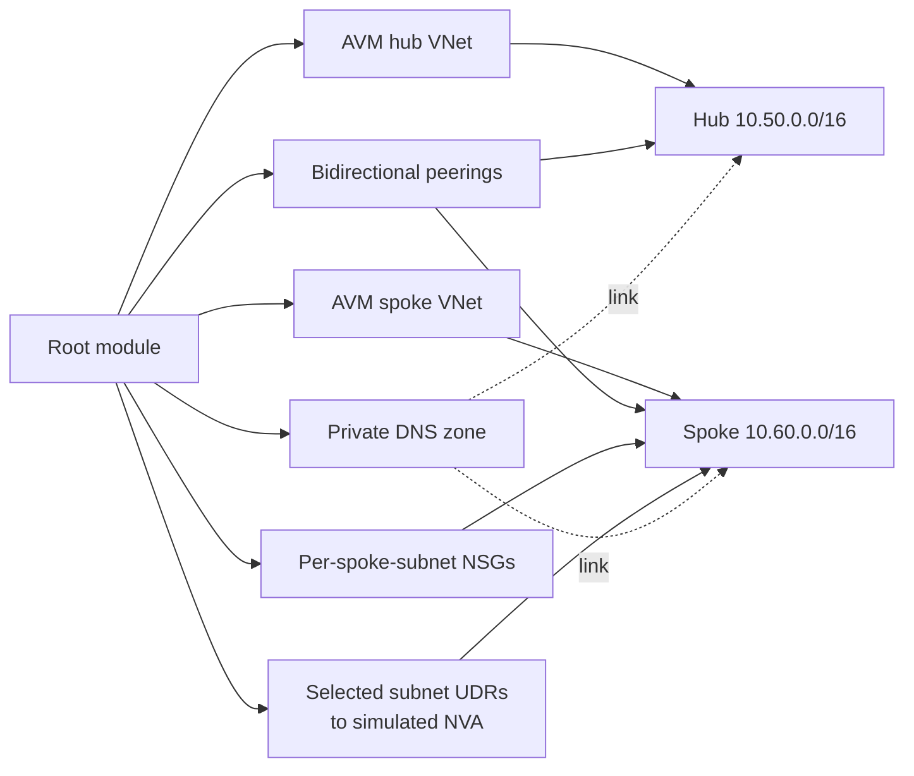

<!--
SPDX-FileCopyrightText: 2026 biro98
SPDX-License-Identifier: MIT
-->

# Lab 09 Advanced Network Capstone Reference Solution

This independent root is one defensible implementation of the challenge. It pins [AVM Virtual Network 0.22.2](https://registry.terraform.io/modules/Azure/avm-res-network-virtualnetwork/azurerm/0.22.2), creates separate hub and workload-spoke module instances, passes NSG and conditional route-table associations through the spoke module contract, and exposes useful root outputs.

It follows [the attendee construction checkpoints](../INSTRUCTIONS.md). Expected inventory: one dedicated group, two VNets, six subnets, four spoke NSGs, one scoped application HTTPS rule, one route table/default route, two directional peerings, one private DNS zone, and two non-registering DNS links. AVM helper resources may add Terraform actions. No VM, gateway, public IP, firewall, storage account, or private endpoint is deployed.

## 1. Prepare the independent root

From the repository root:

```powershell
Set-Location .\lab09-final-challenge\solution
$solutionRoot = (Get-Location).Path
if (-not (Test-Path terraform.tfvars)) {
    Copy-Item terraform.tfvars.example terraform.tfvars
}
Get-Location
```

Personalize `resource_group_name = "rg-tf-lab09-solution-u01"` and matching `unique_suffix = "solution-u01"`; the example/default region is `swedencentral`. Use an approved region. Keep the non-overlapping hub/spoke ranges and subnet flags. The management example `203.0.113.10/32` is documentation-only; choose an approved scoped CIDR, never an unrestricted source.

The group must be new and dedicated to this state, separate from starter, other labs, and VM/platform groups. A suffix cannot isolate the canonical `privatelink.blob.core.windows.net` zone inside a shared group. Existing private inputs remain untouched; deliberately supply the new group input. With old state, stop, back it up securely, and coordinate migration before apply/destroy. `moved` blocks preserve former module/NSG addresses, not physical names: corrected subnet/NSG names and group/location changes can still replace resources. Do not import a shared group, remove state blindly, or reuse an old plan.

On the workshop VM:

```powershell
& 'C:\Program Files\TerraformWorkshop\Connect-WorkshopAzure.ps1'
az account show --output table
Set-Location $solutionRoot
```

The helper changes directory; the last command restores the solution root.
Run all subsequent Terraform commands from this solution directory.

Laptop users must use [workstation authentication](../../common/azure-authentication.md#running-without-the-workshop-vm), not VM identity. No credentials/subscription IDs belong in source. Keep provider registration `none`; bootstrap registers providers. Backend authentication is separate.

## 2. Initialize and validate

Use Terraform `>= 1.14.5, < 2.0.0` and AzureRM `~> 4.0`.

```powershell
terraform init
terraform fmt -check
terraform validate
```

Keep both AVM pins at `0.22.2` and retain locks. Do not use `init -upgrade` or edit downloaded modules. AVM composes its subnet/interface helper modules; its subnet inputs own NSG/route attachments. Never add duplicate standalone associations or AVM peerings alongside the root peerings. Telemetry is disabled. Preserve local overrides/cache/state; overrides can supersede the source's version constraint.

For backend-free validation only, use `terraform init -backend=false`, then `terraform validate`; this neither migrates state nor verifies Azure readiness. A fresh checkout still requires module/provider downloads and creates a local lock file.

### Optional local contract test

After initialization, run:

```powershell
terraform test "-var-file=terraform.tfvars.example" "-filter=tests\contracts.tftest.hcl"
```

Every external provider is mocked, while both real AVM instances and their subnet/interface helpers run. Test-only `apply` uses test state and creates no Azure resources. Assertions cover inventory, CIDRs, NSGs, routing exclusions, policies, peerings, DNS links, and outputs; they do not validate Azure permissions or connectivity. Ordinary plan/apply commands do not run the tests automatically.

### Reference implementation differences

The reference uses locals for repeated names and retains migration `moved` blocks
for older reference states. Its rule, route, peering and DNS-link names differ
slightly from the walkthrough, but its architecture, subnet policies and eight
output names match. It also disables AVM telemetry and BGP route propagation
explicitly and waits for both module instances before creating peerings.
There is no gateway in this lab. Do not copy this reference over an applied
starter: use a separate group/state and review any replacement in an existing
reference deployment.

## 3. Review the complete architecture (before any deployment)

- Hub `10.50.0.0/16`: two subnets, no spoke NSGs/default route.
- Spoke `10.60.0.0/16`: four NSGs; only application has the custom TCP 443 rule from `management_cidr`. Built-in NSG rules still apply, so this is not production deny-all isolation.
- Application, integration, and data receive the `VirtualAppliance` default route to `10.50.1.4`; private endpoints receive no route table and disable private endpoint policies.
- Both peerings enable VNet access and forwarded traffic. Both DNS links disable registration; links alone create no DNS records/private endpoints.
- The simulated appliance is absent: do not test real traffic through that next hop.

## 4. Deploy and inspect (only when authorized)

```powershell
terraform plan -out main.tfplan
terraform show main.tfplan
terraform apply main.tfplan
terraform state list
terraform output
terraform plan
```

Review every action, including module helpers; fresh state should show no changes/destroys or unrelated groups. Saved-plan apply has no confirmation prompt. Regenerate the plan after edits. Expect a no-change post-apply plan, `module.hub`/`module.spoke` state addresses, connected peerings, and these eight outputs:

| Output | Meaning |
| --- | --- |
| `resource_group_name` | Dedicated managed group name. |
| `hub_vnet_id`, `spoke_vnet_id` | AVM VNet resource IDs. |
| `hub_subnet_ids` | Two stable subnet keys mapped to resource IDs. |
| `spoke_subnet_ids` | Four stable subnet keys mapped to resource IDs. |
| `peering_ids` | Hub-to-spoke and spoke-to-hub peering IDs. |
| `spoke_route_table_id` | Root route-table ID. |
| `private_dns_zone_id` | Canonical Blob private DNS zone ID. |

## 5. Cleanup safely

In the owning solution root, review `terraform plan -destroy`, then run `terraform destroy`; type `yes` only after review. The dedicated group and all its contents are deleted. Never add unrelated contents or bypass AzureRM's unmanaged-content deletion safeguard. Verify empty `terraform state list` and `az group exists --name "<your-solution-group>"` returns `false`. Retain state until deletion succeeds and leave other labs/platform/backend resources intact. Only source, example inputs and tests are published; keep private tfvars, state, plans, local overrides and backend configuration out of Git.

## Architecture



The configured next hop, `10.50.1.4`, is illustrative. The solution deliberately does not deploy a firewall or NVA, so the route demonstrates centralized inspection intent without providing a functioning data path through that address.
