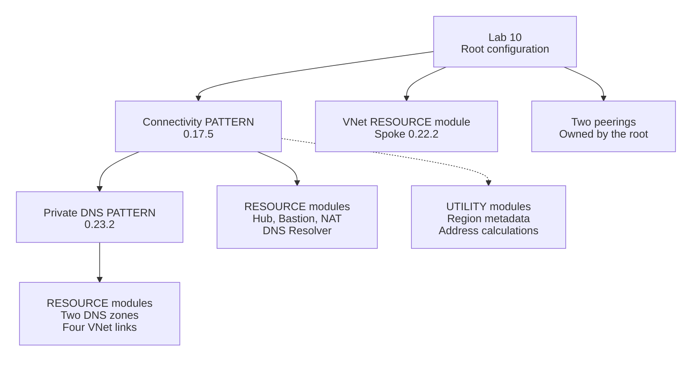
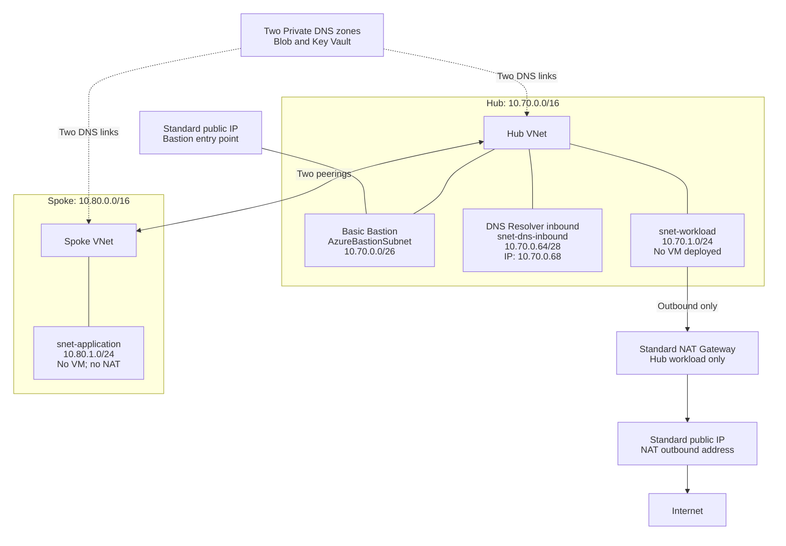

<!--
SPDX-FileCopyrightText: 2026 biro98
SPDX-License-Identifier: MIT
-->

# Lab 10 - Optional Challenge: AVM Networking Patterns

**Difficulty:** Intermediate, with a fully guided solution path

**Estimated time:** 90-120 minutes, plus Azure provisioning and deletion time

**Optional:** Not required to complete the three-day workshop.

Start with [INSTRUCTIONS.md](INSTRUCTIONS.md). It supplies every required code
block, exact insertion points, PowerShell commands, expected results and cleanup
checks. This README explains the architecture and references; it is not a second
deployment sequence. You do not need the instructor's separate solution folder.

**Standalone sandbox lab:** no resources or state from earlier labs are required.
Run it from your local computer with the tools below, or from the supplied workshop
VM. Terraform creates a new resource group and every Azure resource in the diagram.
You do not need an existing VNet, DNS zone, public IP, storage account or remote
state backend.

> **This lab is not free.** Bastion, NAT Gateway, public IPs and DNS Resolver
> endpoints incur charges even when no test workload is running. Private DNS and
> traffic can also incur charges. Get instructor/budget approval before applying
> and reserve time for deletion. Closing VS Code or shutting down the workshop VM
> does not delete these services. You may complete the construction and plan review
> without applying; label that outcome **plan-only**, not deployed.

## Learning objectives

- Explain the difference between AVM resource, pattern and utility modules.
- Use a connectivity pattern that composes other modules, including a DNS pattern.
- Select features explicitly instead of accepting costly enterprise defaults.
- Connect a separately managed spoke using module outputs.
- Inspect real Azure configuration without confusing deployment with traffic tests.
- Remove the whole isolated lab safely using its own Terraform state.

## What makes this a pattern?

Lab 09 assembles many individual networking resources. Here a higher-level
connectivity pattern assembles and wires a collection of network services.
The pattern itself calls a Private DNS pattern, which calls resource modules.
The caller supplies intent through nested objects and feature switches.

### Do I need to write my own modules?

**No. In this lab you call published modules; you do not build a local module.**
The completed files in this lab directory are your **root module**: the
configuration where you run Terraform. Its `module` blocks call **child modules**
from the Terraform Registry. `terraform init` downloads their implementation.
There is no need to create a `modules/` folder, copy AVM source code or use the
instructor's solution or tests.

Resource, pattern and utility describe a module's purpose, not different
Terraform syntax:

| Module purpose | What it provides here |
| --- | --- |
| Resource | A VNet and its subnets |
| Pattern | A connected collection of services, assembled from other modules |
| Utility | Reusable helpers, such as region metadata and address calculations |

The root also declares the resource group and peerings directly. Mixing resource
blocks and module calls is normal. In a real team, consider your own module when
you need to reuse stable company-specific standards; do not add a wrapper merely
to pass the same inputs through to AVM.

The nested DNS pattern is already integrated. Do **not** create a second copy of
the same zones or links outside it. AVM modules are versioned building blocks,
not a guarantee that every default is appropriate for a training environment.

## Architecture

All Azure resources shown belong to the new, dedicated Lab 10 resource group.
Lines from a VNet to its subnet/service boxes indicate membership, not traffic.
The DNS zones are `privatelink.blob.core.windows.net` and
`privatelink.vaultcore.azure.net`. The inbound subnet is delegated to
`Microsoft.Network/dnsResolvers`. Arrows show configured relationships and
capabilities, not successful traffic tests.

Your local computer or supplied workshop VM is a **management client**, not a
workload inside this topology. It runs Terraform and queries Azure management
APIs; no peering, VPN or private connection from it to the new VNets is required.
Do not reconfigure the workshop VM's NIC, DNS, routing, NSG or platform group.

### Included and excluded services

| Component | Lab choice | Reason |
| --- | --- | --- |
| Hub and spoke | One of each, same region | Small, understandable topology |
| Bastion | Basic, dedicated `/26`, one Standard public IP | Show pattern-managed administration infrastructure; no target VM is deployed |
| NAT Gateway | Standard, zone 1, one matching Standard public IP | Explicit outbound capability for the hub workload subnet only |
| Private DNS Resolver | One inbound endpoint, static `10.70.0.68`, dedicated `/28` | Show managed DNS entry point without operating DNS servers |
| Private DNS | Blob and Key Vault zones; each linked to both VNets | Demonstrate nested pattern composition with a small allowlist |
| Firewall and Firewall Policy | Disabled | No traffic inspection appliance required |
| VPN/ExpressRoute gateways | Disabled | No hybrid tunnel/circuit in this exercise |
| DDoS Protection Plan | Disabled | No paid plan; this does not disable Azure's built-in platform protection |
| Resolver outbound endpoints, rulesets and DNS security policy | Not created | No on-premises DNS target or forwarding exercise |
| Route tables, fake appliance routes, extra registration zone | Not created | No unused routes or unexpected DNS zones |
| Workload VMs, private endpoints, storage accounts, Key Vaults | Not created | Zone names do not deploy the corresponding services |

### Important networking boundaries

- **Peering does not share NAT.** Hub NAT cannot provide outbound connectivity for
  the spoke through peering. The spoke has default outbound access disabled and no
  explicit internet egress path.
- **NAT is not a firewall.** It translates outbound source addresses; it does not
  provide application inspection.
- **Private DNS links are not peerings.** A VNet link gives that VNet access to a
  zone; peering alone does not link a zone.
- **An inbound resolver endpoint is not an outbound forwarder.** Reachable clients
  can send DNS queries to it. No forwarding to on-premises is configured.
- The VNets keep Azure-provided DNS. Their links support direct zone resolution;
  this lab does not change VNet DNS servers to the resolver IP.
- Empty Private Link zones do not prove Private Link works. No endpoint-created
  A records or application connectivity are expected.
- There is no target VM for a Bastion session. Verification covers service
  provisioning and subnet/IP configuration, not RDP/SSH.
- This is a teaching topology, not a production landing zone or security baseline.

## Prerequisites and isolation

Choose **one** execution environment; do not deploy from both with separate states:

| Where you run Terraform | What you need |
| --- | --- |
| Your local computer | PowerShell, Terraform 1.14.5 or newer 1.x, Azure CLI and an interactive sign-in to the sandbox subscription |
| The supplied [workshop VM](../scripts/workshop-vm/README.md) | The same tools are preinstalled; use its existing managed-identity helper |

Both paths are covered in section 1 of the instructions. AzureRM and AzAPI use
the selected authentication path. No new VM, service principal, client secret,
role-assignment resource or GitHub runner is part of this lab.

The signed-in user or VM identity must be allowed to create the dedicated group
and its network resources in the sandbox; subscription Contributor is sufficient
for resource creation and is already granted to the supplied VM. The subscription
also needs `Microsoft.Network` registration. The preflight explains how to check
it and what to do if it is missing; it does not require pre-created lab resources.
Registry/GitHub/provider downloads and Azure management endpoints must be
reachable. Policy, quota and regional/SKU availability can still block deployment;
`terraform validate` does not check those.

State is **local to this lab directory**. Do not copy Lab 05's backend files or
provision storage for this exercise. No previous lab deployment, shared network,
DNS infrastructure or imported resource is used. The local machine or supplied
VM is the only execution host needed, and is never managed by this lab's state.

**Validation scope:** the walkthrough has been reconstructed and checked with
Terraform 1.14.5 and provider-mocked tests of the nested modules. These checks do
not deploy Azure resources. Live provisioning and execution on the workshop VM
have not been verified for this lab. Complete the sandbox preflight before
applying; use the supplied VM if local installation or sign-in is unavailable.

The example uses Sweden Central and Standard NAT zone 1. Confirm the region and
services are approved before applying. Do not change a deployed lab's region to
work around a failed service; follow the troubleshooting and cleanup steps first.

Use a new `rg-tf-lab10-<suffix>` group. Never use the platform group or a group from
another lab, participant or Terraform state. Starter and reference solution have
separate states and distinct sample names. A suffix alone cannot isolate canonical
DNS zone names inside a shared resource group.

## Files and workflow

| File | Role |
| --- | --- |
| [INSTRUCTIONS.md](INSTRUCTIONS.md) | Primary, complete construction walkthrough |
| [main.tf](main.tf) | Resource-group starter; add the supplied module/peering blocks |
| [outputs.tf](outputs.tf) | Group output starter; add five outputs |
| [variables.tf](variables.tf) | Complete typed input contract; read, do not rewrite |
| [terraform.tfvars.example](terraform.tfvars.example) | Non-secret example inputs; copy once |
| [terraform.tf](terraform.tf) / [providers.tf](providers.tf) | Version and authentication configuration |

The complete [reference solution and optional tests](solution/README.md) are
published in `solution/`. Complete the walkthrough before comparing with it.
The solution is an independent Terraform root/state, not an extension of the
starter. Do not deploy both roots against the same group.

## References

Use the versioned Registry links below to read the modules' **Inputs** and
**Outputs**. The root calls the connectivity pattern and spoke VNet module;
the connectivity pattern calls the Private DNS pattern internally. Its linked
source shows the remaining nested module calls and their pinned versions.

- [AVM module classifications](https://azure.github.io/Azure-Verified-Modules/specs/shared/module-classifications/)
- [Connectivity pattern 0.17.5](https://registry.terraform.io/modules/Azure/avm-ptn-alz-connectivity-hub-and-spoke-vnet/azurerm/0.17.5)
- [Connectivity pattern source and feature switches](https://github.com/Azure/terraform-azurerm-avm-ptn-alz-connectivity-hub-and-spoke-vnet/tree/v0.17.5)
- [Nested Private DNS pattern 0.23.2](https://registry.terraform.io/modules/Azure/avm-ptn-network-private-link-private-dns-zones/azurerm/0.23.2)
- [Spoke VNet resource module 0.22.2](https://registry.terraform.io/modules/Azure/avm-res-network-virtualnetwork/azurerm/0.22.2)
- [Bastion configuration and subnet requirements](https://learn.microsoft.com/azure/bastion/configuration-settings)
- [NAT Gateway resource and SKU behaviour](https://learn.microsoft.com/azure/nat-gateway/nat-gateway-resource)
- [DNS Private Resolver overview and regional availability](https://learn.microsoft.com/azure/dns/dns-private-resolver-overview)
- [Azure pricing calculator](https://azure.microsoft.com/pricing/calculator/)
- [Bastion pricing](https://azure.microsoft.com/pricing/details/azure-bastion/) / [NAT pricing](https://azure.microsoft.com/pricing/details/azure-nat-gateway/) / [DNS pricing](https://azure.microsoft.com/pricing/details/dns/)
